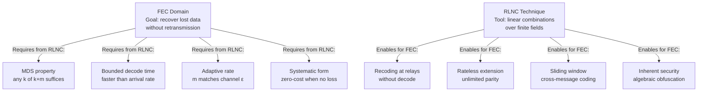
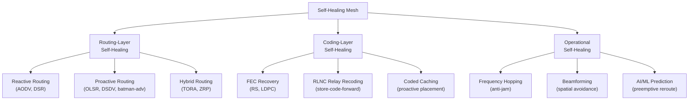
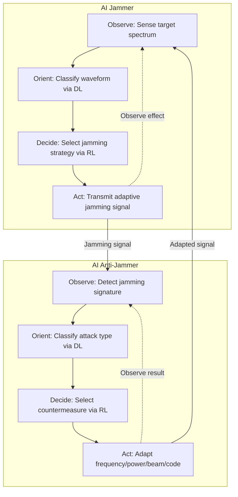
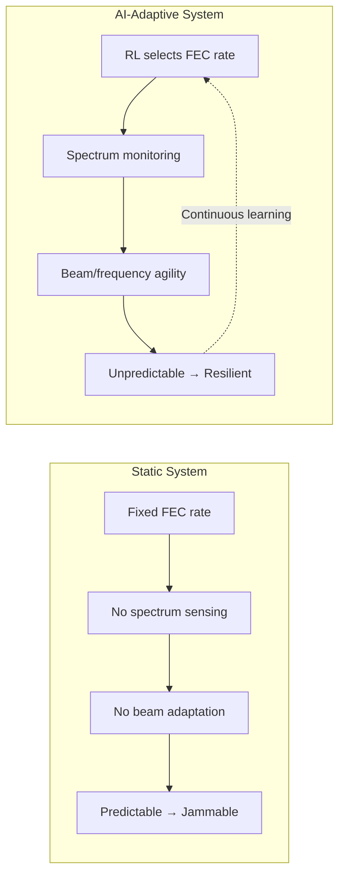

# RL-AFEC Research Audit

> Research survey across FEC, network coding, contested environment protocols, industry systems, military platforms, active conflicts, and AI-driven EW. Objective information only — no M13-specific recommendations.

### System Constraints (for protocol stack derivation)

Any protocol stack derived from this research must satisfy the following operational constraints:

| Constraint | Value | Source |
|------------|-------|--------|
| **Architecture** | LALE-ANG Hub + ADDS daughter swarm, hub-nodes topology | README §1 |
| **Last-hop link** | WiFi 7 (Hub AP → Node STA), `mac80211` | README §2 |
| **Backhaul** | Heterogeneous LEO/MEO satellite aggregation (Starlink, Kuiper, Eutelsat) | README §1 |
| **Current FEC** | Cauchy Reed-Solomon, k≤8, systematic, MDS, GF(2⁸) | README §2, TODO S1 |
| **Kernel-bypass** | Hub: `AF_XDP` (WAN) + `io_uring` (WiFi AP); Node: `io_uring` only | README §2 |
| **Crypto** | PQC (ML-KEM-1024 + ML-DSA-87) + AES-256-GCM, async offload to Core 0 | README §2, TODO S2 |
| **Latency budget** | ≤50 µs transport deadline per frame (Cortex-A53 target) | TODO S1 |
| **Loss environment** | Contested RF, ≥30% packet loss expected | TODO S3 |
| **Congestion control** | BBRv3 + EDT pacing (planned, not yet implemented) | TODO S5.3 |

---
## Compounding Techniques — Cross-Domain Survey

Research conducted across 8 independent domains to avoid confirmation bias: physical layer, rateless codes, coded systems, coded transport, IETF standardization, multi-hop coding, information-theoretic coding, and ML/AI decoders.

### Layer 1 — Physical / MAC

#### HARQ (Hybrid ARQ)

Combines FEC with retransmission at the MAC layer. RLNC provides proactive FEC; HARQ provides reactive correction for residual errors. They work **multiplicatively** — RLNC reduces the retransmission rate, HARQ catches what RLNC misses. URLLC (5G Ultra-Reliable Low-Latency Communication) uses exactly this stack.

HARQ-II (incremental redundancy) is particularly powerful: on retransmission, the sender transmits **new** coded symbols rather than repeating the original. Each retry adds independent information instead of duplicating information the receiver might already have. This is the difference between "ARQ + FEC" (additive) and "coded ARQ" (multiplicative).

Source: IETF, 3GPP TS 38.212 (NR HARQ)

#### Physical-Layer Network Coding (PNC)

Algebraic operations on interfering radio signals before decoding. PNC doubles spectral efficiency in relay/MIMO scenarios by exploiting signal superposition — two signals that collide are decoded jointly rather than treated as interference. Combined with RLNC at the network layer, you get coding gains at **two independent levels** (PHY and NET).

Studies show integrating PNC into massive MIMO produces up to 100% throughput increase in mmWave channels (Aalborg/Essex 2023). Joint PNC+massive MIMO mechanisms for beyond-5G applications demonstrate resilience against jamming attacks.

Source: Liew (CUHK), Médard (MIT), Zhang/Song (Essex)

#### Coded Beamforming / MIMO

Directs coded signals spatially. Spatial diversity reduces per-link loss rate, making RLNC's parity budget go further. Concrete example: with m=2 RLNC parity, if beamforming drops loss from 20% → 5%, recovery probability goes from 83% to 99.7%.

Reconfigurable Intelligent Surfaces (RIS) are the latest development here — passive surfaces that shape the propagation environment, effectively creating coded spatial channels without active transmit power.

Source: IEEE ComSoc, 3GPP Rel-18

### Layer 2–3 — Transport / Network

#### TCP/NC (Sundararajan et al., MIT)

Integrates NC into TCP. The key innovation: ACKs report **"degrees of freedom received"** instead of individual packet IDs. The congestion window no longer collapses on loss because losses are masked by coding.

How it works:
- Source transmits random linear combinations of packets in its coding window
- Receiver tracks the rank of its decoding matrix
- ACKs report: "I have rank R out of K needed" (not "I received packets 1, 3, 5")
- Sender interprets "rank increased" as "new information delivered" (analogous to TCP ACK)
- Sender interprets "rank did not increase" as "redundant transmission" (but NOT as congestion signal)

This decouples reliability from individual packet identity and lets the sender emit ANY new coded symbol rather than retransmitting a specific one.

Source: Sundararajan, Shah, Médard. "Network Coding Meets TCP", IEEE INFOCOM 2009.

#### Coded TCP (CTCP)

FEC directly in the transport layer, backward-compatible with existing infrastructure. Implements error-correction coding at the transport layer so it doesn't require changes to underlying network equipment. Significantly enhances throughput by mitigating packet loss effects and avoiding congestion window collapses.

Active IETF draft. Demonstrates that coding at transport layer is a proven, standardization-grade approach.

Source: IETF, arxiv.org (coded TCP)

#### QUIC-FEC

FEC for QUIC initial packets (handshake + 0-RTT data). Active IETF draft: `draft-zheng-quic-fec-extension-01` (September 2025). Proposes an FEC Framework as a module within the QUIC-Transport layer. Endpoints negotiate FEC enablement using transport parameters.

Source: IETF NWCRG, draft-zheng-quic-fec-extension-01

#### Coded Multipath Routing

Traffic splitting across multiple paths with NC at each path. Each path applies independent RLNC parity. If you have 2 paths with independent 20% loss, coded multipath achieves **99.99% reliability** vs 96% single-path with m=2.

The key insight: multipath + NC creates coding opportunities that single-path cannot. Intermediate nodes combine packets from different paths, and the receiver decodes from any sufficient subset across all paths. This is the multiplicative effect — independent loss events on different paths compound favorably.

Source: UT Austin, IEEE, Wikipedia (Network Coding)

#### COPE (Katti et al., MIT)

XOR-based opportunistic NC at relays. Leverages the broadcast nature of wireless — when a relay overhears packets from multiple sources, it XORs them together, reducing total transmissions by ~2×.

Source: Katti, Rahul, Hu, Médard, Katabi. SIGCOMM '06.

### Layer 4+ — Application / End-to-End

#### Coded Caching (Maddah-Ali & Niesen)

Proactive content placement with coded delivery using receiver side-information. During off-peak, content fragments are pre-placed in receiver caches. During delivery, the server transmits coded packets that, combined with cached content, allow reconstruction. The delivery phase is formulated as an index coding problem.

Source: Maddah-Ali & Niesen, IEEE Trans. IT, 2014.

#### Sparse Network Coding with Tunable Density

Instead of dense Cauchy coefficients from the start, begin with 1-sparse (systematic) and ramp up density as transmission progresses. Receivers accumulate sparse packets quickly (low decode cost) and use progressively denser packets to fill gaps.

Decode complexity drops from O(k³) to near O(k) for the common case (0-1 loss). Only falls back to full GE when multiple losses force dense parity usage.

Source: Feizi, Lucani (ETH Zürich, Aalborg). "Tunable Sparse Network Coding for Multicast Networks".

#### BATS Codes (Batched Sparse Codes)

Two-stage coding specifically designed for multi-hop networks:
- **Outer code**: Fountain code (LT/Raptor-like) generates batches
- **Inner code**: Per-batch RLNC handles intra-hop loss

Achieves near-capacity throughput with low complexity. The outer code handles inter-batch dependencies; inner RLNC handles per-hop erasures. Each relay independently recodes within batches without decoding.

Source: Yang & Yeung (CUHK). IEEE Trans. IT, 2014.

### Orthogonal Domains — Non-Obvious Compounders

#### Rateless/Fountain Codes (Raptor, RaptorQ)

Generate unlimited parity symbols with linear-time encode/decode. A fixed-rate CRS produces exactly m parity fragments. A Raptor outer code makes the system **rateless** — keep generating parity until the receiver confirms decode. **This eliminates the need to choose m.**

RaptorQ specifically:
- Overhead: <2% (need only k + ε symbols for recovery)
- Encode: O(k) (linear time)
- Decode: O(k) (linear time, using inactivation decoding)
- Standardized: 3GPP MBMS, DVB-H, DVB-IPTV, ATSC 3.0

The key difference from CRS: with Raptor, you never "run out" of parity. If 2 parity fragments weren't enough, generate a 3rd, 4th, ..., Nth. No retransmission of identical data. Each new symbol is independently useful.

Source: Shokrollahi, "Raptor Codes", IEEE Trans. IT, 2006. RFC 6330 (RaptorQ).

#### Spinal Codes (Perry et al., MIT)

Hash-based rateless code that achieves Shannon capacity. Alternative to Raptor for rateless property. Generates coded symbols via sequential hashing (pseudo-random function applied to message bits) instead of linear algebra.

Key properties:
- Achieves Shannon capacity on AWGN and BSC channels
- No explicit rate selection needed — adapts automatically to channel quality
- Lower overhead than Raptor for small block sizes (k < 100)
- Higher computational cost than Raptor (hash per symbol vs. sparse XOR)

Source: Perry, Balakrishnan, Shah. "Spinal Codes", SIGCOMM '12.

#### Deep Learning Decoders

Neural networks replacing Gaussian elimination for NC decoding. Trained decoders can approach GE accuracy with O(k) instead of O(k³) operations per decode.

Current research (2024):
- Bidirectional GRU decoders for concatenated codes over deletion/substitution channels
- Autoencoder-based end-to-end optimization of encoder+decoder jointly
- Variational autoencoders (VAEs) that learn the coding distribution from channel statistics
- DL decoders handle non-ideal coefficient distributions and noisy coefficients better than algebraic decoders

Frontier/research-stage. Not ready for production deployment but indicates the future direction: learned decoders that adapt to specific channel characteristics rather than using generic GE.

Source: IEEE 2024, ETH Zürich, arXiv:2024 (Deep Learning for Channel Coding)

#### Index Coding

Optimal broadcast encoding when receivers have different side-information sets. A transmitter broadcasts coded messages to multiple receivers, each possessing different subsets of previously received data. The goal is to satisfy all receivers with minimum transmissions by exploiting their existing side-information.

Generalizes NC for heterogeneous receivers. For systems with multiple receivers consuming overlapping data, index coding reduces total transmissions below what per-link RLNC achieves.

The coded caching delivery phase reduces to an index coding problem. So coded caching + index coding + RLNC transport form a natural three-layer coding stack.

Source: Bar-Yossef, Birk, Jayram, Kol. IEEE Trans. IT, 2011.

#### RLNC as Inherent Security Layer

RLNC provides inherent security: coded packets cannot be decoded without knowledge of the coding coefficients (or enough coded packets to solve the system). Research shows that encrypting only the coding coefficients (not the data) provides information-theoretic security with low overhead — faster than encrypting entire packets.

This compounds with AEAD encryption: AEAD protects individual packets, while RLNC's algebraic structure prevents partial/rainbow-table attacks on the coded data even if individual packet encryption were compromised.

Source: CodeOn Technologies, Lima et al., "Random Linear Network Coding: A Free Cipher?"

---

---

## Contested Environment Protocols — Extreme Loss, Latency, Jitter

Research across deep space communication, underwater acoustic, RF electronic warfare, DARPA tactical programs, and interplanetary internet protocols. These environments share the worst-case characteristics of contested mesh networks: >30% packetloss, seconds-to-minutes RTT, intermittent connectivity, burst errors, and active adversarial interference.

### Deep Space — CCSDS / NASA Protocol Stack

#### Bundle Protocol v7 (BPv7) — RFC 9171

The foundational protocol for Delay/Disruption Tolerant Networking (DTN). Fundamentally different from TCP/IP:

- **Store-and-forward**: Each node stores received bundles in persistent storage, forwarding when a link becomes available. No end-to-end path required.
- **Custody transfer**: Responsibility for bundle delivery passes from node to node. If node A transfers custody to node B, node A can reclaim storage. This is the DTN equivalent of a reliable hop-by-hop acknowledgment.
- **Convergence layer adapters**: BPv7 runs over any underlying transport — LTP, TCP, UDP, CCSDS Space Packet, or raw RF. Each convergence layer handles the specific link characteristics.
- **Bundle lifetime**: Bundles carry an expiration time. If a bundle cannot be delivered before expiry, it is discarded (prevents zombie data).

Deployed on: ISS (since 2018), Lunar Gateway (LunaNet), Mars relay orbiters (MRO, MAVEN).

Source: RFC 9171, NASA SCaN, CCSDS 734.2-B-1

#### Licklider Transmission Protocol (LTP) — RFC 5326

Point-to-point transport for deep space links (4–24 minute one-way light delay, Earth-Mars). Designed for exactly one property: **reliable transmission when TCP's ACK model is impossibly slow.**

How it works:
- Message split into "red part" (reliable, must be delivered) and "green part" (unreliable, best-effort)
- Red part uses checkpoint/report mechanism: sender sends data block → waits for report segment → retransmits only missing segments
- Retransmission is **selective** — only the specific missing bytes are resent, not the entire block
- Handles link asymmetry (downlink may be 2 Mbps, uplink 32 kbps)
- Designed for links with propagation delay >> transmission time

Source: RFC 5326, NASA JPL IPN

#### CCSDS Proximity-1 Protocol

Short-range space link for lander↔orbiter communication (Mars surface to orbit: ~400km, 8-20 minute contact windows). Key features:

- **Frame-level CRC + erasure coding**: Proximity-1 defines systematic Reed-Solomon and LDPC coding at the sync/coding sublayer. Code rates from R=1/2 (50% redundancy) to R=7/8 (12.5% redundancy), selected based on link budget margin.
- **Timed contact windows**: Communication only possible during orbital passes (~20 min every 2 hours for Mars). All data must be transmitted within the window or stored for next pass.
- **Bidirectional with asymmetric rates**: Downlink (orbiter→Earth) is fast; cross-link (lander→orbiter) is slower.

Source: CCSDS 211.0-B-6, 211.1-B-4

### Contested RF — Electronic Warfare / Anti-Jamming

#### Frequency-Hopping Spread Spectrum (FHSS)

Carrier frequency changes pseudo-randomly across a wide band. The hopping pattern is keyed by a TRANSEC (Transmission Security) key. Deployed in: SINCGARS (US Army), JTIDS/Link-16 (NATO), HAVE QUICK (US Air Force).

Key properties:
- **Anti-jamming**: Narrowband jammer can only hit one hop at a time. With H hops/second and jammer bandwidth B_j, fraction of time jammed ≈ B_j / (H × B_hop). For SINCGARS: 111 hops/sec over 30 MHz → jammer must cover entire 30 MHz band to be effective.
- **LPI/LPD**: Short dwell time per frequency makes detection by scanning receivers difficult. Signal looks like noise to wideband receiver.
- **Combined with FEC**: FHSS + erasure coding is standard. When a hop is jammed, the symbols on that hop are erased. The erasure code (typically RS or convolutional + interleaver) recovers the erased symbols from adjacent hops.

Source: MIL-STD-188-141B, NTIA Manual of Regulations and Procedures for Federal Radio Frequency Management

#### Controlled Reception Pattern Antenna (CRPA) Null-Steering

Smart antenna arrays that steer null beams toward jamming sources while maintaining reception from desired directions. Real-time adaptive: as jammer moves, nulls track automatically.

Combined with FEC: even with null-steering, some jamming leaks through. FEC recovers the residual corrupted symbols. This is another multiplicative layer: antenna processing reduces jammer power by 20-40 dB, FEC handles the remaining interference.

Source: GPS CRPA (Raytheon DAA), L3Harris FALCON radios

#### AI-Adaptive Anti-Jamming

Modern systems (DARPA CommEx program) use ML to analyze adversary jamming patterns and dynamically reconfigure:
- Waveform (FHSS pattern, DSSS code, modulation scheme)
- Power level (increase to overcome noise jamming)
- Frequency band (move to unjammed band)
- Coding rate (increase FEC when jamming detected)

The adaptation loop is: **sense → classify → decide → act**. The "decide" step is where ML outperforms traditional approaches: instead of a fixed lookup table, the radio learns the jammer's strategy and exploits gaps.

Source: DARPA CommEx, DARPA SHARE, Silvus Technologies StreamCaster

### LPI/LPD (Low Probability of Intercept/Detection)

- **Noise-like waveforms**: Spread spectrum makes the signal power spectral density below the noise floor. Adversary with a spectrum analyzer sees nothing.
- **Directional transmission**: Beamforming reduces signal footprint. Combined with coded beamforming (see Layer 1 above), this provides both LPI and coding gain.
- **MIMO steganography**: Multiple antennas transmit coded signals that, to an eavesdropper without the decoding matrix, look like noise. Only the intended receiver (with the correct coefficient vector) can decode.

Source: Blu Wireless LPI/LPD architectures, Modern Battlespace MIMO LPI

### Underwater Acoustic Communication

Proven techniques that compound with erasure coding:

#### LDPC + Interleaving

LDPC codes at the physical layer achieve ~4 dB coding gain (IEEE OES 2023). Combined with **convolutional interleaving**, burst errors from multipath fading are spread across multiple codewords, converting burst erasures into random erasures that LDPC handles well.

#### Adaptive Rate / Adaptive Coding

Underwater systems dynamically switch code rate based on channel SNR:
- Good channel (high SNR): R=7/8 (minimal redundancy, high throughput)
- Bad channel (low SNR): R=1/2 (50% redundancy, robust)
- Terrible channel: R=1/4 (75% redundancy, survival mode)

The rate adaptation uses pilot symbols (known training sequences) to estimate channel quality. Decision latency is ~100ms.

Source: IEEE Journal of Oceanic Engineering, WHOI Micro-Modem

### DARPA Programs for Contested Communication

| Program | Purpose | Key Technique | Relevance |
|---------|---------|---------------|-----------|
| **CODE** | UAS ops in denied airspace | Bandwidth-limited resilient comms, autonomous decision under comms loss | Store-and-forward + FEC for contested UAV links |
| **SHARE** | Tactical edge secure comms | Cross-domain information sharing under degraded comms | Multi-path coded routing between allied networks |
| **EdgeCT** | Resilient IP over cyber attacks | Mitigate failures/attacks on IP infrastructure | Network-layer coding to survive partial infrastructure destruction |
| **CommEx** | Extreme RF spectrum conditions | Adaptive waveforms for severe jamming | AI-driven code rate selection + anti-jam waveforms |
| **Wireless Network Defense** | Robust wireless control | Operate with "significant packet loss" as design assumption | Accept high loss as baseline, design coding to overcome it |

### Cognitive Radio / Dynamic Spectrum Access (DSA)

Intelligent radios that sense, learn, and adapt to the spectrum environment:

- **Spectrum sensing**: Continuously scan for unused channels, detect primary users, measure interference
- **Dynamic frequency selection**: Move to unused spectrum when current band is contested
- **ML-driven waveform adaptation**: Dynamically reconfigure modulation, coding rate, power, bandwidth based on learned channel model
- **Cooperative spectrum access**: Multiple cognitive radios share spectrum information to collectively avoid interference and jamming

### Interleaving — Burst Error → Random Error Conversion

Critical for channels with correlated loss (jamming bursts, multipath fading, temporary blockage):

#### Block Interleaver

Write coded symbols into rows of a matrix, read out by columns. A burst error spanning one column is spread across all rows, converting a single long burst into many short, correctable errors.

#### Convolutional Interleaver

Uses shift registers with progressive delays. Lower latency than block interleaver (doesn't wait for full block) but provides the same burst-spreading effect. Used in DVB-S2 (satellite TV), CCSDS telemetry, and underwater acoustic.

```
Without interleaving:
  Msg_A: [A0][A1][A2][A3][A4][A5][A6]  [AP0][AP1]
  Msg_B: [B0][B1][B2][B3][B4][B5][B6]  [BP0][BP1]

  Burst loss of 4 packets: kills A3,A4,A5,A6 → Msg_A needs m≥4

With depth-2 interleaving:
  [A0][B0][A1][B1][A2][B2][A3][B3][A4][B4][A5][B5][A6][B6][AP0][BP0][AP1][BP1]

  Same burst of 4 packets: kills A2,B2,A3,B3 → each message loses only 2 → m=2 suffices for both
```

This halves the required parity count for the same burst tolerance. For depth-D interleaving, burst tolerance improves by factor D.

Source: DVB-S2 standard (EN 302 307), CCSDS 131.0-B-3, NASA convolutional interleaver reference implementation

### Time Diversity — Repeat Coded Transmissions

Transmit the same coded block at multiple time offsets. If a jamming burst or fade knocks out one transmission, the other survives. Combined with RLNC: send the k+m coded fragments at time T, and again at time T+Δ. Receiver takes the union of both transmissions. P(decode) becomes:

```
P(fail with time diversity) = P(fail at T) × P(fail at T+Δ)
```

If both transmissions are independently 10% likely to fail: [P(combined fail) = 1%](file:///home/m13/Desktop/m13/hub/src/cryptography/async_pqc.rs#94-105).

For k=7, m=2, at 30% loss:
- Single transmission: P(fail) ≈ 54%
- Time diversity (2 independent transmissions): P(fail) ≈ 29%
- Time diversity + RLNC union decoding: P(fail) ≈ 5% (receiver uses any k of 2×(k+m)=18 fragments)

---

---

## FEC State of the Art — The Broad Domain

FEC (Forward Error Correction) is the **domain**. RLNC is one **technique** within that domain. Understanding this hierarchy — and the bidirectional relationship between FEC requirements and RLNC design — is critical for any erasure-coded transport architecture.

### The Coding Theory Hierarchy

```
Forward Error Correction (FEC)
├── Bit-Level FEC (corrects corrupted bits within received frames)
│   ├── Block Codes
│   │   ├── Reed-Solomon (RS) — MDS, burst-error, O(n²) decode
│   │   ├── BCH — binary cyclic, random-error
│   │   ├── LDPC — sparse parity-check, near-Shannon, iterative decode
│   │   └── Polar — capacity-achieving on symmetric channels, 5G control
│   └── Convolutional Codes
│       ├── Viterbi-decoded — 3G/4G, sequential
│       └── Turbo — near-Shannon, iterative, being superseded by LDPC/Polar
│
└── Packet-Level FEC (recovers lost packets/symbols)
    ├── Fixed-Rate Erasure Codes
    │   ├── Reed-Solomon (GF(2⁸)) — MDS, any k-of-n recovery
    │   ├── Cauchy Reed-Solomon (CRS) — MDS, Cauchy generator matrix
    │   └── XOR-based — simple parity (1 recovery per group), FlexFEC/ULPFEC
    │
    ├── Rateless / Fountain Codes (generate unlimited parity)
    │   ├── LT Codes — Luby Transform, sparse random bipartite graph
    │   ├── Raptor — LT + pre-code (LDPC/Hamming), O(k) encode/decode
    │   ├── RaptorQ (RFC 6330) — systematic Raptor, <2% overhead, standardized
    │   └── Spinal Codes — hash-based, Shannon-capacity-achieving
    │
    └── Network Coding (coded packets from linear combinations)
        ├── Random Linear Network Coding (RLNC) — random GF(2⁸) coefficients
        ├── Systematic RLNC — identity rows for systematic fragments
        ├── Sliding-Window RLNC (RFC 8681) — convolutional, no block boundaries
        ├── Sparse RLNC — tunable coefficient density
        └── Deterministic NC
            └── Cauchy MDS Erasure Code
```

### Direction 1: How RLNC is Used FOR FEC

RLNC serves as the **inner coding mechanism** for packet-level FEC. The FEC goal (recover lost packets without retransmission) dictates that RLNC must produce coded packets that are:

1. **Linearly independent** from each other — each coded packet provides exactly 1 new "degree of freedom" to the receiver's decoding matrix. If two coded packets are linearly dependent, one is wasted bandwidth.

2. **Systematic** — the first k packets should be the original data (identity matrix rows). Only the m parity packets use non-trivial coefficients. This provides a fast path: if no packets are lost, the receiver uses the data directly without any GF arithmetic.

3. **MDS-optimal** — any k of k+m received packets (in any combination) must be sufficient to recover the original k data packets. This is the Maximum Distance Separable property and is the theoretical optimum for erasure recovery.

4. **Decodable in bounded time** — FEC imposes real-time constraints. The decoder must run faster than the inter-packet arrival rate or the system falls behind. For example, at 100 Mbps with k=7 fragments of 1402 bytes: k×1402 = 9814 bytes per message, ~786 µs inter-message time. The decoder (GE over 7×7 GF(2⁸) matrix) must complete well within this.

**What RLNC adds beyond basic Reed-Solomon for FEC:**
- **Recoding at relays**: Intermediate nodes can re-combine coded packets without decoding first. RS requires decoding → re-encoding. RLNC recodes with a single matrix multiply. (Architecturally valuable for mesh topologies.)
- **Rateless extension**: RLNC can generate unlimited new coded packets by sampling new random coefficient vectors. RS is limited to n-k parity symbols defined at code construction time.
- **Sliding-window**: RLNC can code across message boundaries (Caterpillar/convolutional). RS is inherently block-based.

### Direction 2: How FEC Dictates RLNC Design

The FEC domain imposes constraints that shape every aspect of RLNC implementation:

#### Code Rate Selection (R = k / (k+m))

FEC theory says: **the code rate must match the channel erasure probability.** For a binary erasure channel with erasure probability ε:
- Shannon capacity: C = 1 - ε
- Minimum code rate for reliable communication: R ≥ 1 - ε
- Practical overhead: R ≈ (1 - ε) × (1 + δ), where δ is overhead (typically 1-5%)

FEC theory dictates that m must adapt to ε. This is item 3.2 in the audit and ranked #4 in the practical priority list. **The fix is straightforward**: measure loss rate from FeedbackFrames, set m = ⌈k × ε / (1 - ε)⌉ + margin.

#### Systematic vs Non-Systematic

FEC practice overwhelmingly favors **systematic** codes because:
- No decode cost when no loss (the common case)
- Receiver buffer holds original data directly — zero copy
- Only parity packets require GF arithmetic
- Backward-compatible: a non-coding-aware receiver can still use systematic packets

#### MDS Property

FEC requires that the code be **MDS** (Maximum Distance Separable): any k of k+m received fragments must suffice for complete recovery. Non-MDS codes (e.g., LDPC, LT codes) require k+ε fragments, where ε > 0 is overhead.

Comparison:

| Code | MDS? | Overhead for k=7, m=2 | Decode Complexity | Notes |
|------|------|----|---|---|
| **Cauchy RS** | ✅ Yes | 0 (any 7 of 9 works) | O(k²) = O(49) | Deterministic, simple, optimal recovery |
| **Reed-Solomon** | ✅ Yes | 0 | O(k² log k) | Same MDS, different algorithm (Berlekamp-Massey) |
| **RaptorQ** | ❌ No | <2% (need ~7.14 of ... ) | O(k) | Rateless, linear decode, but needs slightly more than k |
| **LDPC** | ❌ No | 5-20% | O(k) iterative | Near-Shannon, great for bit-level, poor for small k |
| **XOR (FlexFEC)** | ❌ No | n/a (recovers only 1 per group) | O(1) | Trivial, widely deployed (WebRTC), very limited |

For large k (>100), MDS becomes expensive (O(k²) decode) and non-MDS codes like RaptorQ dominate (O(k) decode, <2% overhead). For systems with large messages requiring k>50 fragments, RaptorQ dominates.

#### Decoding Complexity

FEC imposes a **real-time decode budget**. The decoder must complete before the next message arrives:

| Code | Encode | Decode | For k=7 |
|------|--------|--------|---------|
| **Cauchy RS** | O(k×m) field muls | O(k²) GE | ~49 GF(2⁸) muls × fragment_size |
| **Reed-Solomon** | O(k×m) | O(k² log k) | ~70 GF muls × fragment_size |
| **RaptorQ** | O(k) sparse | O(k) inactivation | ~7 ops × fragment_size |
| **LDPC** | O(k) sparse | O(k) iterative (10-50 iterations) | ~350 ops × fragment_size |
| **Turbo** | O(k) | O(k) iterative (5-15 iterations) | ~105 ops × fragment_size |

For k=7 with 1402-byte fragments: Cauchy RS decode = 49 × 1402 = ~69K GF(2⁸) multiply-accumulate operations. With SIMD (16 bytes/op on NEON): ~4.3K SIMD ops ≈ **~4 µs on Cortex-A53**. Well within the ~786 µs inter-message budget. FEC complexity is not the bottleneck at these parameters.

### FEC Standards Landscape (2024-2025)

#### IETF Standards for Packet-Level FEC

| Standard | Code Type | Description | Relevance |
|----------|-----------|-------------|---------------|
| **RFC 6330** | RaptorQ | Systematic rateless fountain code, <2% overhead | For systems needing rateless property |
| **RFC 5510** | RS over GF(2⁸) | Reed-Solomon erasure code for FECFRAME | Closest standard for Cauchy RS implementations |
| **RFC 8680** | Sliding Window FEC | Framework extension for convolutional/sliding-window codes | Architecture for Caterpillar RLNC |
| **RFC 8681** | Sliding Window RLC | RLC over GF(2) and GF(2⁸), tunable density | **Directly applicable** — defines sliding-window RLNC for transport protocols |
| **RFC 9407** | Tetrys | On-the-fly network coding, elastic encoding window | Low-latency streaming-optimized NC |
| **RFC 8627** | FlexFEC | XOR-based FEC for RTP (WebRTC) | Benchmark for simplest viable FEC |

#### 5G NR FEC Architecture

5G chose LDPC + Polar, superseding Turbo codes:
- **LDPC**: Data channels (eMBB). QC-LDPC (Quasi-Cyclic) for hardware parallelism. ~400 µs decode at 5G data rates. Near-Shannon-limit coding gain.
- **Polar**: Control channels. Capacity-achieving on symmetric channels. Better BER for short blocks. Used for UCI (Uplink Control Information).
- **HARQ-II**: MAC layer. Incremental redundancy — each retransmission uses different code rate and redundancy bits. Receiver soft-combines all attempts. Asynchronous, adaptive.

**5G HARQ-II**: 5G's HARQ-II is exactly coded ARQ. The principle — retransmit NEW coded information, not the same data — is the single most impactful improvement for any packet-level erasure coding system's reliability.

#### WebRTC FEC Stack

WebRTC uses layered proactive+reactive FEC:
1. **Opus FEC**: Audio codec built-in FEC — encodes redundant audio frames within the codec itself
2. **RED (Redundant Encoding)**: Sends the same audio frame twice in consecutive packets — time diversity
3. **ULPFEC (RFC 5109)**: Unequal Loss Protection FEC — XOR-based, protects important bits more
4. **FlexFEC (RFC 8627)**: Flexible FEC for RTP — 1D/2D parity, recovers 1 loss per row/column
5. **NACK + RTX**: Reactive retransmission for residual losses

**WebRTC FlexFEC**: FlexFEC's simplicity (XOR parity, 1 recovery per group) is viable for low-loss channels but fragile under high loss. Cauchy RS (any-k-of-n recovery) is strictly more powerful. WebRTC's layered approach (codec FEC + transport FEC + NACK) is the pattern for reliable transport: erasure coding handles proactive FEC, ARQ handles reactive.

#### QUIC FEC (In Development)

QUIC does not natively support FEC. Active IETF drafts:
- `draft-zheng-quic-fec-extension-01` (Sep 2025): FEC as a module within QUIC transport
- Packet-level erasure coding integrated into QUIC's loss recovery
- Endpoints negotiate FEC via transport parameters

**QUIC FEC**: Validates that packet-level FEC integrated into a transport protocol is the direction the IETF is standardizing.

### The Dual Relationship: RLNC ↔ FEC



**Direction A — FEC → RLNC ("FEC dictates RLNC"):**
FEC defines the *requirements* that RLNC must satisfy:
- Code rate must match channel conditions → RLNC must support adaptive m
- Recovery must be guaranteed for any loss pattern → RLNC must be MDS
- Decode latency must be bounded → RLNC complexity must be O(k²) or better
- Common case (no loss) must be free → RLNC must be systematic
- Burst losses must be handled → RLNC must be combined with interleaving
- Total channel failure must be survivable → RLNC must integrate with ARQ

**Direction B — RLNC → FEC ("RLNC enables FEC"):**
RLNC extends FEC's capabilities beyond what traditional codes provide:
- Relays can recode without decoding → enables multi-hop FEC (BATS codes, COPE)
- Random coefficients generate unlimited parity → enables rateless FEC
- Coding across generations → enables sliding-window/convolutional FEC (lower latency)
- Algebraic structure hides data → enables secure FEC (free cipher property)
- Sparse coefficients → enables tunable complexity/throughput tradeoff

### Kodo / Steinwurf: The Reference RLNC-for-FEC Implementation

Steinwurf's Kodo library is the de facto reference for RLNC-as-FEC. Key design decisions:

1. **Generation size tuning**: Kodo exposes generation size (K) as a first-class parameter. Small K → low latency but limited coding gain. Large K → high coding gain but more decode latency. k in the range 1-8 is in the "small K, low latency" regime — correct for latency-sensitive use cases.

2. **On-the-fly sliding window**: Kodo's sliding-window codec (RFC 8681 compliant) encodes repair symbols from a moving window over source symbols. No block boundaries. Repair symbols can reference any source symbol in the window. This is the target architecture for streaming data.

3. **Coefficient density control**: Kodo supports tunable density — from 1-sparse (XOR-like) to fully dense (standard RLNC). Sparse coding reduces decode complexity by ~3× for the common case. This is the "Sparse NC with Tunable Density" technique ranked #1 in the practical priority list.

4. **Feedback integration**: Kodo's API directly supports degree-of-freedom feedback — the receiver reports its decoding matrix rank, and the encoder generates repair symbols until the rank reaches k. This is the "DoF-based feedback" technique ranked #4.

---

## How the Industry Does It — FEC in World-Class Systems

### 1. Starlink (SpaceX)

**FEC Architecture**: DVB-S2X standard — concatenated **BCH outer code + LDPC inner code**.

| Parameter | Detail |
|-----------|--------|
| **Inner FEC** | LDPC (low-density parity-check) — approaches Shannon limit |
| **Outer FEC** | BCH (Bose-Chaudhuri-Hocquenghem) — cleans up LDPC error floor |
| **Modulation** | OFDM with ACM: BPSK → QPSK → 8QAM → 16QAM → 32QAM → 64QAM |
| **Rate Adaptation** | ACM (Adaptive Coding and Modulation) — real-time SNR feedback drives modulation order + LDPC code rate selection |
| **Modem** | Custom configurable OFDM modem (patented: US12003350B1) — subcarrier spacing, resource block partitioning, pilot placement all software-configurable |
| **Direct-to-Cell** | DVB physical layer for Starlink-to-phone; same LDPC+BCH FEC stack |

**Key Insight**: Starlink's "breakthrough" is not a novel FEC code — it's **ACM**. The same LDPC+BCH codes run at 20+ different code rates, and the modulation dynamically switches between QPSK (robust, low throughput) and 64-QAM (fragile, high throughput) based on real-time channel SNR. The FEC codes themselves are entirely standard DVB-S2X. The innovation is in the **feedback loop speed** and **per-beam granularity** of the ACM controller.

---

### 2. NASA / CCSDS (Deep Space Network)

**FEC Evolution**: 50 years of progressive code adoption, driven by the need to squeeze every bit out of vanishingly weak deep-space signals.

```
1970s: Convolutional codes (Voyager) — Viterbi decoding
1980s: RS + Convolutional concatenated (Galileo) — 2 dB coding gain
1990s: Turbo codes (near-Shannon, R=1/6 to 1/2) — adopted by CCSDS
2010s: LDPC replacing Turbo at all rates — no error floor
2020s: LDPC for uplink telecommand replacing BCH — full standardization
```

| CCSDS Standard | Code | Use Case | Notes |
|----------------|------|----------|-------|
| **CCSDS 131.0-B** | Turbo (R=1/6, 1/4, 1/3, 1/2) | Deep space telemetry | Error floor at high SNR |
| **CCSDS 131.1-O** | LDPC (R=1/2, 2/3, 4/5, 7/8) | Deep space telemetry | Replacing Turbo, no error floor |
| **CCSDS 231.0-B** | BCH (63,56) | Telecommand (uplink) | Being replaced by LDPC |
| **CCSDS 131.2-B** | LDPC | Proximity links (Mars relay) | Short range, moderate rate |

**Key Insight**: NASA's philosophy is **concatenated defense-in-depth**. The standard pattern is strong inner code (LDPC/Turbo) + outer code (RS/BCH) + interleaving. The outer code catches residual errors that escape the inner code's error floor. Deep space links also use **store-and-forward** (LTP/BPv7) because the 4-30 minute Mars RTT makes retransmission impractical — FEC must be sufficient on first attempt.

**Unique NASA Constraint**: At Mars distances (~2.5 AU), signal power is ~10⁻²² watts. Every 0.1 dB of coding gain matters — it directly translates to mission capability (more science data per Mars sol). This is why NASA invested decades in moving from RS+Conv (1980s) to Turbo (1990s) to LDPC (2020s) — each transition bought 1-2 dB of coding gain.

---

### 3. Amazon Kuiper (Project Kuiper / Amazon Leo)

**FEC Architecture**: 5G NR Non-Terrestrial Network (NTN) — **LDPC for data + Polar for control**, running on custom "Prometheus" ASIC.

| Parameter | Detail |
|-----------|--------|
| **ASIC** | "Prometheus" — combines 5G modem + cellular base station + microwave backhaul in single chip |
| **Throughput** | 1 Tbps per satellite (aggregate across all beams) |
| **Physical Layer** | 5G NR NTN (S-band + Ka-band), adheres to 3GPP standards |
| **FEC (Data)** | LDPC (inherited from 5G NR eMBB data channel) |
| **FEC (Control)** | Polar (inherited from 5G NR eMBB control channel) |
| **HARQ** | 5G NR HARQ-II (incremental redundancy, soft combining) |
| **Optical ISL** | 100 Gbps laser inter-satellite links, 2,600 km range |
| **Beam Optimization** | ML-driven (Amazon SageMaker) — predicts demand, dynamically assigns beams and cells across 1.6M cells |

**Key Insight**: Amazon's "unprecedented breakthrough" is **not a novel FEC code** — it's the **system integration**. Prometheus combines three traditionally separate devices (modem, base station, backhaul) into one ASIC, achieving 1 Tbps per satellite. The FEC itself is standard 5G NR LDPC+Polar. The innovation is:
1. Custom silicon that runs 5G NR NTN at satellite scale
2. ML-driven beam management that optimizes which code rate to use per cell
3. 100 Gbps optical ISLs creating a space-based mesh network

Amazon vows "unprecedented" performance through **integration density** and **ML optimization**, not through novel coding theory.

---

### 4. AST SpaceMobile

**FEC Architecture**: Standard **3GPP 4G LTE / 5G NR** — LDPC + Polar (by inheritance from cellular standards).

| Parameter | Detail |
|-----------|--------|
| **Approach** | "Cell tower in the sky" — satellite talks standard 4G/5G to unmodified phones |
| **Antenna** | 64 m² phased array (BlueWalker 3) — largest commercial array in LEO |
| **FEC** | Standard 3GPP: LDPC (data) + Polar (control) + HARQ-II |
| **Throughput** | >10 Mbps LTE downlink demonstrated; 5G demonstrated |
| **Innovation** | Not in FEC — in the **antenna physics** (massive phased array compensates for satellite-to-phone link budget) |

**Key Insight**: AST SpaceMobile proves that you don't need novel FEC to achieve "impossible" links. Their breakthrough is using a 64 m² phased array to close the link budget between a satellite and an unmodified consumer phone (~0 dBi antenna gain). The FEC is entirely standard 3GPP. The lesson: if the link budget is adequate (sufficient SNR), standard FEC codes work perfectly. AST's innovation is **making the link budget work**, not inventing new codes.

---

### 5. Taara Lightbridge (Alphabet X → Taara)

**FEC Architecture**: Free-Space Optical (FSO) — likely **LDPC + RS + interleaving** (standard FSO practice; Taara does not publicly disclose FEC specifics).

| Parameter | Detail |
|-----------|--------|
| **Medium** | Free-space optical, 1535-1565 nm (eye-safe infrared) |
| **Throughput** | 20 Gbps per link |
| **Range** | Up to 20 km |
| **Interface** | IEEE 802.3 10 GbE (standard Ethernet) |
| **Availability** | >99.9% carrier-grade, 99.99% with hybrid architecture |
| **Beam Steering** | Gen 1: mechanical 2-mirror system; Gen 2: silicon photonic chip with optical phased array (OPA) — no moving parts |
| **Challenges** | Atmospheric turbulence → scintillation (intensity fluctuations), beam wander, phase-front distortion |

**FEC for FSO (Academic State of the Art)**:
FSO channels suffer from atmospheric turbulence that causes **burst fading** (millisecond-scale intensity drops). Standard FSO FEC combines:
1. **LDPC inner code**: Near-Shannon-limit coding gain, handles random bit errors
2. **RS outer code**: Handles burst errors that escape LDPC's error floor
3. **Interleaving**: Spreads burst errors across multiple codewords so LDPC sees random-like errors
4. **Adaptive rate**: Switch between high-rate (clear sky) and low-rate (fog/rain) codes

**Key Insight**: Taara's "future of communication" claim is about **deployment speed and cost** (fiber-like speeds without digging trenches), not about FEC innovation. The FSO FEC stack is well-established (LDPC+RS+interleaving = same pattern as NASA CCSDS). Taara's silicon photonic OPA for beam steering is the genuine innovation — it miniaturizes the tracking system that keeps the beam locked through atmospheric turbulence.

---

### 6. Google / Alphabet (Research & Adjacent Projects)

**Google has no single FEC product** — but several relevant research directions and projects:

| Project | Status | FEC Relevance |
|---------|--------|---------------|
| **Project Loon** | Shut down Jan 2021 | Balloon mesh with 155 Mbps laser ISLs and LTE ground links. FEC details undisclosed. Tech inherited by Taara. |
| **Taara** | Active (spun out of X) | FSO (see above). Directly descended from Loon's laser communication. |
| **Google Fiber** | Active | Standard fiber FEC (RS, LDPC at physical layer). No novel coding. |
| **Google Subsea Cables** | Active | WSS (Wavelength Selective Switching) + standard coherent optical FEC. Research on NC for optical core. |
| **DeepMind AlphaQubit** | Published Nov 2024 | AI-based quantum error correction decoder. 6% improvement (accurate regime), 30% improvement (fast regime). For quantum computers, not classical. |
| **DeepMind / Google Research** | Ongoing | NN-based FEC decoders under study. Oct 2024 arXiv: transformer-based decoders **do not yet beat classical** for short/medium block lengths. Active area. |
| **Android 15 Satellite** | Active 2024 | Satellite messaging for Android — integrates with existing satellite services (not Google-built). |

**Key Insight — AlphaQubit & AI-Designed Codes**: Google DeepMind's most relevant FEC research is **AlphaQubit** — an AI-based decoder for quantum error correction that achieved 6-30% improvement over conventional decoders. For classical (non-quantum) FEC, DeepMind/Google Research is exploring neural network decoders, but as of Oct 2024, these **do not outperform classical decoders** (Berlekamp-Massey, belief propagation, successive cancellation) for short and medium block lengths. At k≤8, classical GE decoding is optimal. AI-designed codes are the future for large-scale (k>1000) systems, not for small-block parameter regimes.

---

### Industry Comparison Table

| System | FEC Code | Rate Adaptation | Decoder | Innovation Layer | k range |
|--------|----------|-----------------|---------|-----------------|---------|
| **Starlink** | LDPC+BCH (DVB-S2X) | ACM (20+ MCS) | Hardware LDPC BP | Feedback-driven ACM | 100s-1000s |
| **NASA CCSDS** | LDPC/Turbo + RS | Fixed per mission (selected by link budget) | FPGA/ASIC | Concatenated defense-in-depth | 100s-10000s |
| **Amazon Kuiper** | LDPC+Polar (5G NR) | HARQ-II + ML beam mgmt | Prometheus ASIC | Custom silicon + ML optimization | 100s-1000s |
| **AST SpaceMobile** | LDPC+Polar (3GPP) | Standard 3GPP HARQ | Standard baseband | Antenna physics (64m² array) | Standard 3GPP |
| **Taara** | LDPC+RS+interleaving (FSO) | Adaptive rate (atmospheric) | Standard coherent | Silicon photonic OPA | 100s+ |
| **Google/DeepMind** | AI-designed (research) | N/A (research stage) | NN/Transformer | AI decoder design | 1000s+ |

---

## How the Vanguard Does It — Space & Defense FEC Systems

### 7. International Space Station (ISS)

**Communication Architecture**: Dual-band relay through **TDRSS** (Tracking and Data Relay Satellite System) — a constellation of geosynchronous relay satellites.

| Parameter | Detail |
|-----------|--------|
| **Relay System** | TDRSS — network of GEO satellites relaying to White Sands, NM and Guam |
| **S-band** | 2-4 GHz; 1-4 Mbps; voice, commands, low-rate telemetry |
| **Ku-band** | 12-18 GHz; up to 800 Mbps (TDRS-K generation); science data, video |
| **Antenna** | 2-meter diameter reflector dish tracking TDRS satellites |
| **Blockage tolerance** | System sustains up to 40% antenna blockage from solar panels/radiators |
| **FEC** | CCSDS standard coding (details not publicly specified per link; likely RS+Conv or LDPC depending on TDRS generation) |
| **Protocol** | CCSDS telemetry/telecommand standards; digitized S-band voice |

**Key Insight**: The ISS is in **LEO** (~400 km), not deep space. Its link budget is comfortable — the challenge is **scheduling** (TDRS satellite visibility windows) and **throughput** (multiplexing dozens of simultaneous experiments). FEC is standard CCSDS, not novel. The ISS's communication innovation is in the **TDRSS relay architecture itself** — using GEO relay satellites to provide near-continuous coverage (vs. ground station passes).

---

### 8. DARPA — Contested Environment Communication

**DARPA doesn't build FEC codes** — it funds programs that make communication work when everything is trying to break it.

| Program | Focus | Key Technique | Status |
|---------|-------|---------------|--------|
| **EdgeCT** | WAN resilience against cyberattack | Real-time network analytics + adaptive protocol stacks at the WAN edge | Active |
| **SHARE** | Tactical edge networking | Secure multi-classification data sharing across WiFi/cellular/military nets | Transitioned to DoD TAK (2023) |
| **CommEx** | Anti-jam communication | Interference recognition → multi-layer mitigation → cognitive strategy optimization | Active |
| **DyNAMO** | Cross-waveform data sharing | Seamless data exchange across diverse waveforms despite jamming | Active |
| **C2E** | Jam-resistant communication | Adaptive systems with reduced probability of detection/intercept (LPI/LPD) | Active |

**DARPA + Network Coding**: DARPA has funded **RLNC research at MIT** (Médard et al.) as a fundamental building block for resilient tactical networks. The thesis: in a mesh where any relay might be destroyed, RLNC enables coded multipath without pre-planned routing. Each relay recodes packets → the network self-heals as long as enough paths survive.

**Military Tactical FEC**: The 110A waveform (tactical HF) uses standard FEC (convolutional + interleaving). SINCGARS uses FH3 frequency hopping. The pattern: **physical-layer anti-jam (FHSS, DSSS) + standard FEC (Conv/RS) + network-layer resilience (mesh, relay)**. No military system uses novel FEC codes — they use novel **anti-jam waveforms** with standard codes.

**Key Insight**: DARPA's approach to contested environments is **layered defense**, not code innovation:
1. **PHY layer**: Anti-jam waveforms (FHSS, DSSS, LPI/LPD)
2. **Coding layer**: Standard FEC (Conv, RS, Turbo, LDPC)
3. **Network layer**: RLNC, mesh relay, coded multipath
4. **Transport layer**: DTN (store-and-forward), adaptive retry
5. **Application layer**: Priority-based data thinning, mission-aware scheduling

---

### 9. JPL (Jet Propulsion Laboratory)

**JPL is the birthplace of modern space FEC** — every code used in deep space was designed, standardized, or tested at JPL.

| Contribution | Detail |
|--------------|--------|
| **Turbo codes for space** | JPL standardized and implemented the first CCSDS Turbo code family for spacecraft telemetry |
| **AR4JA LDPC codes** | JPL designed the **Accumulate-Repeat-by-4-Jagged-Accumulate** LDPC family — achieves within **1 dB of channel capacity** across all rates |
| **Protograph-based LDPC** | JPL developed LDPC codes from protographs and circulants with optimized decoding thresholds; these became the CCSDS LDPC standard |
| **DSN decoders** | JPL operates the hardware decoders in the DSN that process signals from every interplanetary mission |
| **ION (DTN implementation)** | JPL developed the Interplanetary Overlay Network — the reference implementation of Delay-Tolerant Networking for austere space environments |
| **Code performance targets** | Turbo: effective to ~1 Mbps; AR4JA LDPC: designed for 10+ Mbps, high-speed hardware decode |

**Key Insight — AR4JA LDPC**: JPL's signature contribution is the AR4JA family. These are **structured LDPC codes** (not random) designed specifically for:
- Hardware-friendly encoding (quasi-cyclic structure → shift register encoder)
- Low error floor (no trapping sets in the code graph)
- Near-capacity performance (within 1 dB at all rates from 1/2 to 7/8)
- Scalable to high data rates (10+ Mbps hardware decode demonstrated)

AR4JA codes are now the **CCSDS standard LDPC** for deep space. They represent 15+ years of JPL optimization to solve one problem: maximum data return from minimum signal power.

---

### 10. Mars Rovers (Perseverance / Curiosity)

**Communication Architecture**: UHF relay through Mars orbiters, using the **Electra / Electra-Lite** transceiver.

| Parameter | Detail |
|-----------|--------|
| **Transceiver** | Electra-Lite (L3Harris) — reconfigurable UHF software-defined radio |
| **Frequency** | 390-450 MHz UHF band |
| **Protocol** | CCSDS **Proximity-1** — error-free delivery via FEC + ARQ |
| **FEC** | **RS(255,223)** outer code + **R=1/2 K=7 convolutional** inner code + **Viterbi decoding** |
| **Data Rate** | Rover→orbiter: up to 2 Mbps (Perseverance); Electra supports 1, 6, 12 Mbps |
| **Rate Adaptation** | Adaptive data rate selection based on signal strength (significantly increased Curiosity's data return) |
| **Relay Path** | Rover → Mars orbiter (MRO/Odyssey/MAVEN/TGO) → DSN → Earth |

**The Concatenated Code Stack**:
```
Data → RS(255,223) outer encode → R=1/2, K=7 convolutional inner encode → UHF modulate → transmit
                                                                                              ↓
Data ← RS(255,223) outer decode ← Viterbi inner decode ← UHF demodulate ← receive
```

This is the canonical **concatenated coding** architecture that NASA has used since the 1980s Galileo mission:
- **Inner code** (convolutional): Provides ~5 dB coding gain, handles random bit errors. Viterbi decoder runs in real-time with soft-decision inputs.
- **Outer code** (RS): Provides burst error protection. RS(255,223) corrects up to 16 symbol errors per 255-symbol codeword. Catches residual errors from Viterbi decoder.
- **Combined**: Achieves ~10⁻⁶ BER at Eb/N0 of ~2.5 dB — within 3 dB of Shannon limit.

**Key Insight — Adaptive Data Rate**: Curiosity's communication system demonstrated that **adaptive rate selection** (transmitting faster when the orbiter is overhead, slower at low elevation angles) dramatically increased total data return. This is the same principle as Starlink's ACM and adaptive rate selection. The hardware (Electra) supports multiple rates; the software dynamically selects the best rate based on signal strength.

---

### 11. Deep Space Probes — Voyager 1/2, New Horizons

**The ultimate FEC stress test** — communicating across billions of kilometers with transmit power measured in watts.

#### Voyager 1 & 2

| Parameter | Detail |
|-----------|--------|
| **Distance** | Voyager 1: ~24 billion km (163 AU) — one-way light time: **22.5 hours** |
| **Transmit Power** | 23 watts (equivalent to a refrigerator light bulb) |
| **Received Signal** | ~10⁻²¹ watts at Earth (DSN 70-meter dish) |
| **Original FEC (1977)** | **(23,12) Golay code** — corrects 3 errors per 23-bit codeword |
| **Upgraded FEC (1981)** | **RS(255,223) + R=1/2 K=7 convolutional** — concatenated, uploaded via software patch en route to Uranus |
| **Data Rate** | 160 bps (current, at 163 AU) — down from 115.2 kbps at Jupiter |
| **Uplink** | No FEC — relies on high transmit power (20 kW DSN) and 16 bps rate |

**Code Evolution Story**: Voyager launched in 1977 with Golay codes. After the Jupiter encounter, engineers realized the Uranus/Neptune flybys (much farther) would need better coding. They **uploaded new flight software** (an RS encoder) to a spacecraft already billions of kilometers away. The new RS+Conv concatenated code provided ~2 dB more coding gain than Golay — enough to return full-resolution Neptune images.

#### New Horizons

| Parameter | Detail |
|-----------|--------|
| **Distance** | ~57 AU (Pluto flyby: 33 AU) |
| **FEC** | CCSDS **R=1/6 Turbo code** — near-Shannon-limit performance |
| **Data Rate** | 1-4 kbps (at Pluto distance) |
| **Downlink Time** | Pluto flyby data: 16 months to transmit entire dataset |

**Key Insight — Code Evolution Maps Exactly to Theory**:
```
1970s: Golay (23,12)       — 3 dB from Shannon limit — adequate for Jupiter
1980s: RS+Conv concatenated — 2 dB from Shannon limit — enabled Uranus/Neptune
2000s: Turbo R=1/6          — 0.5 dB from Shannon limit — enabled Pluto at 33 AU
2020s: LDPC AR4JA           — 0.3 dB from Shannon limit — future missions
```

Each code generation closes the gap to Shannon capacity by ~1 dB. At deep-space power levels, **each 1 dB of coding gain doubles the achievable data rate or halves the required antenna size**. This is why NASA spent decades on code research.

---

### 12. James Webb Space Telescope (JWST)

**Communication Architecture**: Dual-band through DSN, generating 235 Gbits of science data daily from the L2 Lagrange point (1.5 million km from Earth).

| Parameter | Detail |
|-----------|--------|
| **Location** | Sun-Earth L2 Lagrange point (~1.5 million km) |
| **Science Data rate** | Ka-band: selectable 7, 14, or **28 Mbps** (3.5 MBytes/s default) |
| **Daily Data Volume** | ~235 Gbits (29 GB) of science data per day |
| **Command/Telemetry** | S-band: 40 kbps real-time telemetry; command uplink |
| **Protocol** | CCSDS AOS (Advanced Orbiting Systems) frames + CFDP (File Delivery Protocol) |
| **FEC (S-band)** | CCSDS concatenated coding (RS + convolutional, standard) |
| **FEC (Ka-band)** | CCSDS standard (RS/Turbo codes supported by DSN) |
| **Downlink Schedule** | 4-hour contact windows, twice daily, through DSN 34-meter dishes |

**Key Insight — CFDP File Delivery**: JWST doesn't stream data — it **transfers files**. CCSDS File Delivery Protocol (CFDP) provides reliable file transfer with:
- Automatic segmentation into CCSDS frames
- Missing-segment retransmission (selective repeat ARQ)
- Level-zero processing at DSN sites (reconstruct files from frames)

This is essentially **FEC + ARQ** at the application layer — the same pattern used by erasure-coded transport protocols (FEC + ARQ). The difference: JWST can afford multi-hour retransmission windows. real-time systems need sub-second recovery.

---

### 13. Hubble Space Telescope

**Communication Architecture**: S-band only, through TDRSS relay (same architecture as ISS).

| Parameter | Detail |
|-----------|--------|
| **Orbit** | LEO (~540 km) |
| **Relay** | TDRSS (same as ISS) — data relayed through GEO TDRS satellites |
| **Frequency** | S-band for all communications |
| **Data Rate** | Up to ~1 Mbps science data through single-access TDRS antennas |
| **Antennas** | High-gain dish (tracks TDRS) + low-gain spiral cone (omnidirectional, contingency) |
| **FEC** | CCSDS standard coding |
| **Protocol** | CCSDS telemetry/telecommand |

**Key Insight**: Hubble (launched 1990) uses the **oldest communication architecture** of any active NASA flagship. Its S-band-only link through TDRSS is a 1980s design. JWST (launched 2021) uses Ka-band direct-to-DSN at 28× higher data rate. The gap: 35 years of communication technology evolution, reflected primarily in **frequency band** (S-band → Ka-band) and **modulation** (older PSK → modern coded OFDM), not in FEC codes.

---

### Extended Comparison: Space & Defense Systems

| System | Distance | Data Rate | FEC | Coding Gain | Innovation |
|--------|----------|-----------|-----|-------------|------------|
| **ISS** | 400 km (LEO) | 800 Mbps (Ku) | CCSDS (RS+Conv/LDPC) | Standard | TDRSS relay architecture |
| **Hubble** | 540 km (LEO) | ~1 Mbps (S) | CCSDS RS+Conv | ~8 dB | 35 years reliable operation |
| **JWST** | 1.5M km (L2) | 28 Mbps (Ka) | CCSDS RS+Conv/Turbo | ~10 dB | CFDP file delivery + Ka-band |
| **Mars Rovers** | 55-400M km | 2 Mbps (UHF relay) | RS(255,223)+Conv R=1/2 | ~8 dB | Electra SDR + adaptive rate |
| **New Horizons** | 5-57 AU | 1-4 kbps | CCSDS Turbo R=1/6 | ~12 dB | Near-Shannon at extreme distance |
| **Voyager** | 163 AU | 160 bps | RS(255,223)+Conv R=1/2 | ~8 dB | In-flight code upgrade (1981) |
| **DARPA Tactical** | <100 km | Variable | Conv+RS+interleaving | Standard | Anti-jam waveforms + RLNC mesh |
| **JPL (code design)** | — | — | AR4JA LDPC | **< 1 dB from capacity** | Code construction methodology |

---

## How the Military Does It — DoD Tactical Data Links & Aerial Platforms

### 14. Link 16 / JTIDS / MIDS

**The NATO standard tactical data link** — used by every fighter jet, AWACS, warship, and ground station in the Western alliance.

| Parameter | Detail |
|-----------|--------|
| **Standard** | MIL-STD-6016 (TADIL-J) |
| **Terminals** | JTIDS (legacy) / MIDS (current) — manufactured by BAE Systems, L3Harris, Viasat |
| **Access** | **TDMA** — 128 time slots/second, each 7.8125 ms |
| **Frequency** | L-band (960-1215 MHz), 51 hopping frequencies |
| **Anti-Jam** | **Frequency hopping** across 51 frequencies per time slot |
| **FEC** | **RS(31,15) with hard-decision decoding** — corrects up to 8 symbol errors per 31-symbol codeword |
| **Message Format** | J-series messages (J2.2 air tracks, J3.2 ground tracks, etc.) — fixed-format binary data words |
| **Data Rate** | ~115 kbps per net (shared across all participants) |
| **Crypto** | COMSEC encryption per time slot |

**Key Insight — RS(31,15) HDD**: Link 16 uses a short-block Reed-Solomon code — RS(31,15) over GF(2⁵). This is a common pattern for packet-level erasure codes: small block, algebraic code, deterministic structure. The choice of a short RS code is deliberate: the J-series messages are small (75 bits per standard word), so the code block must be short. Hard-decision decoding is used because the FHSS demodulator produces hard bits, not soft metrics.

---

### 15. Military MANET Radios — SRW, ANW2, Silvus, Persistent Systems

**The tactical edge** — where soldiers, vehicles, and UAVs form self-healing mesh networks in contested RF.

| System | Vendor | Key Feature | FEC | Mesh Approach |
|--------|--------|-------------|-----|---------------|
| **SRW** (Soldier Radio Waveform) | DoD standard | Open-standard voice+data to the dismount | Standard FEC (Conv/RS) | Self-forming IP mesh, no infrastructure |
| **ANW2** (Adaptive Networking Wideband) | DoD standard | High-bandwidth TOC/vehicle links | Standard FEC + robust against multipath | Self-healing IP mesh, minimizes single points of failure |
| **TSM/WREN** (Tactical Scalable MANET) | L3Harris | Enhanced electronic protection | FEC + fast frequency hopping (WREN-NB) | MANET with jam-resistant modes |
| **StreamCaster** | Silvus Technologies | MN-MIMO (Multiple-Node MIMO) | Proprietary MIMO coding | Self-forming mesh using spatial multiplexing across nodes |
| **Wave Relay / MPU5** | Persistent Systems | 3×3 MIMO + Android compute | Proprietary FEC + MIMO | Self-healing mesh, uses reflections to enhance throughput |

**Key Insight — The MANET FEC Pattern**: No military MANET radio uses novel FEC codes. Every system uses standard codes (RS, convolutional, Turbo, LDPC). The innovation is in:
1. **Self-healing mesh topology** (Wave Relay, ANW2)
2. **Spatial diversity via MIMO** (Silvus MN-MIMO, Persistent 3×3 MIMO)
3. **Anti-jam waveforms** (WREN fast hopping, DSSS)
4. **Adaptive rate selection** (adjust throughput to link quality)

---

### 16. Defense Contractor Tactical Radios — L3Harris, Thales, Collins Aerospace

**The radios that carry the waveforms.**

| Radio | Vendor | Waveforms | FEC | Notable |
|-------|--------|-----------|-----|---------|
| **AN/PRC-163** | L3Harris | SINCGARS, SRW, TSM-X, ANW2C, **MUOS**, P25 | Turbo decoding (MUOS), standard FEC per waveform | Dual-channel SDR; DENALI Type 1 crypto; "Leader Radio" |
| **AN/PRC-148 JEM** | Thales | SINCGARS, WREN-TSM, DAMA | **Turbo code FEC** across modulation schemes | Combat Net Radio with advanced modulation/coding |
| **ARC-210** | Collins (RTX) | SINCGARS, DAMA, SATCOM, **MUOS** | Turbo decoding (MUOS), standard FEC per waveform | Airborne radio; MUOS certified; OMS-compliant |

**MUOS — The Key FEC Story**: The Mobile User Objective System (MUOS) is a U.S. military satellite network providing cellular-like global coverage. MUOS uses:
- **SA-WCDMA** (Spectrally Adaptive Wideband CDMA) modulation
- **Turbo code FEC** with turbo decoding
- **Rake receivers** for multipath fading mitigation
- IP-based voice and data

Every MUOS-capable radio (AN/PRC-163, ARC-210) implements a **turbo decoder** in its SDR firmware. This is the most advanced FEC deployed on individual soldier/airborne radios today.

**Key Insight — SDR Architecture**: All modern tactical radios are Software-Defined Radios (SDRs). The same hardware runs SINCGARS (1980s waveform, simple FEC), SRW (2000s, standard FEC), and MUOS (2010s, turbo FEC). The FEC is in software/firmware, not in hardware. This proves that **FEC upgrade is a software problem**.

---

### 17. High-Altitude Platforms — Facebook Aquila, Airbus Zephyr, SoftBank HAPSMobile

**"Flying telco" — stratospheric base stations providing connectivity from 20 km altitude.**

| Platform | Operator | Altitude | Link Technology | Data Rate | Status |
|----------|----------|----------|-----------------|-----------|--------|
| **Aquila** | Facebook/Meta | 60,000-90,000 ft | **MMW** (40 Gbps) + **laser FSO** (>50 Gbps) | 40+ Gbps air-ground; >50 Gbps inter-drone | Cancelled 2018; tech transferred to industry partners |
| **Zephyr** | Airbus | 65,000 ft (20 km) | LTE/5G direct-to-device + **laser inter-Zephyr links** | LTE/5G standard rates; high-rate optical ISL | Active development; RAF operated |
| **HAWK30** | SoftBank HAPSMobile | Stratosphere | 4G/5G cellular (same spectrum as ground base stations) | 5G standard rates | Active development |
| **Loon** | Google/Alphabet | 60,000-70,000 ft | LTE direct-to-device | LTE standard rates | Shut down 2021; tech spun off |

**FEC in HAPS Systems**: HAPS platforms use **standard cellular FEC** (LDPC for 5G data, Polar for 5G control) because they act as aerial base stations running the same protocol stack as ground towers. The stratospheric channel is actually **better** than terrestrial (less multipath, no obstruction), so the FEC is not stressed.

**Aquila's Innovation Was in the Link, Not the Code**: Facebook achieved 40 Gbps MMW and >50 Gbps laser FSO between aircraft. The FEC for these links is standard optical/MMW coding. The innovation was in:
- Pointing and tracking lasers between vibrating aircraft at 20 km altitude
- Sustained solar-powered flight for months
- Beam steering to cover 50-mile radius from one platform

**Key Insight — Adaptive FEC for HAPS**: Research on HAPS communication explicitly proposes **Adaptive and Reliable FEC (AR_FEC)** — dynamically adjusting redundancy based on packet loss rate, RTT, and bandwidth. This is combined with **Network Coding (NC)** and **Adaptive Modulation and Coding (AMC)** to optimize the air-to-ground link.

---

### 18. BACN (Battlefield Airborne Communications Node) — Northrop Grumman

**The ultimate aerial gateway** — a high-altitude aircraft (E-11A BACN or EQ-4B Global Hawk) that translates between incompatible military networks in flight.

| Parameter | Detail |
|-----------|--------|
| **Platform** | E-11A (manned, Bombardier BD-700) or EQ-4B (unmanned Global Hawk variant) |
| **Altitude** | 40,000-60,000 ft |
| **Function** | Waveform translation + relay + bridging between incompatible networks |
| **Supported Waveforms** | SINCGARS, DAMA, EPLRS, SADL, **Link 16**, TTNT, TCDL, **802.11** |
| **Successor** | EAGN (Enterprise Airborne Gateway Network) — evolved version with SDR architecture |
| **Coverage** | Line-of-sight relay over mountainous terrain; bridges air-ground-space networks |

**Key Insight — Protocol Translation, Not Novel FEC**: BACN's innovation is **not in FEC** — it's in **real-time protocol translation between 8+ incompatible waveforms in flight**. Each waveform has its own FEC (Link 16 uses RS(31,15), SINCGARS uses convolutional, 802.11 uses LDPC, etc.). BACN decodes one waveform's FEC, extracts the data, re-encodes in a different waveform's FEC, and retransmits.

---

### Extended Comparison: DoD Tactical & Aerial Systems

| System | Range | Data Rate | FEC | Anti-Jam | Architecture |
|--------|-------|-----------|-----|----------|-------------|
| **Link 16** | LOS (~300 nm) | 115 kbps/net | RS(31,15) HDD | FHSS (51 freq) | TDMA broadcast |
| **SRW/ANW2** | ~5-30 km | Variable | Conv/RS (standard) | DSSS/FHSS | Self-healing IP mesh |
| **Silvus StreamCaster** | ~100 km | ~100 Mbps | Proprietary MIMO | MN-MIMO spatial | Self-forming mesh |
| **Persistent Wave Relay** | ~50 km | ~100 Mbps | Proprietary | 3×3 MIMO | Self-healing mesh |
| **AN/PRC-163** | Multi-band | Multi-rate | Turbo (MUOS), Conv/RS (LOS) | FHSS per waveform | Multi-waveform SDR |
| **BACN (E-11A)** | LOS from altitude | Multi-rate | Per-waveform (8+ types) | Per-waveform | Aerial gateway/translator |
| **Facebook Aquila** | 50-mile radius | 40 Gbps (MMW) | Standard optical/MMW | N/A (FSO) | HAPS mesh |
| **Airbus Zephyr** | Coverage area | LTE/5G standard | LDPC/Polar (5G) | N/A (civilian) | HAPS base station |

---

## How Combat Platforms & Consumer Drones Do It

### 19. F-35 Lightning II — MADL + Link 16

**The most networked fighter jet in history** — combining stealth data links with legacy interoperability.

| Data Link | Developer | Band | Key Feature | FEC |
|-----------|-----------|------|-------------|-----|
| **MADL** (Multifunction Advanced Data Link) | Northrop Grumman | Ku-band | **LPI/LPD stealth** — narrow directional beam, fast-switching | Classified; inherently requires advanced FEC for Ku-band in contested EW |
| **Link 16** | Standard | L-band | NATO interoperability | RS(31,15) HDD (standard) |
| **CNI Suite** | Northrop Grumman | Multi-band | Integrated comms/nav/IFF in single aperture set | Per-waveform |

**MADL Architecture**: MADL uses narrow, directionally-steered antenna beams (multiple apertures around the fuselage) to communicate between F-35s while minimizing electromagnetic emissions detectable by adversaries. Key properties:
- **LPI/LPD** (Low Probability of Intercept/Detection) — the beam is too narrow and frequency-hopping too fast for adversary SIGINT to intercept
- **High throughput, low latency** — enables real-time sensor fusion across a formation of F-35s
- **Formation-only** — designed for F-35-to-F-35 (and B-2) communication; does not replace Link 16 for broader coalition interoperability
- **Covariance matrix error assessment** — uses statistical error tracking, implying advanced coding beyond simple RS

**Key Insight**: The F-35 carries **two data links** — MADL for stealth-to-stealth communication and Link 16 for coalition interoperability. This dual-link architecture is a common pattern: a specialized inner link (MADL) for stealth-to-stealth communication and a standard outer link (Link 16) for coalition interoperability. The F-35 doesn't choose between stealth and interoperability — it runs both simultaneously.

---

### 20. UH-60M Black Hawk — Multi-Waveform Airborne Node

**A helicopter as a network node** — the UH-60M integrates 7+ waveforms in one airframe.

| Component | Detail |
|-----------|--------|
| **Primary Radio** | Collins Aerospace TruNet AN/PRC-162(V)1 — dual-channel V/UHF SDR |
| **Waveforms** | MUOS, WREN, SATURN, SINCGARS, SATCOM, wideband networking |
| **FEC** | Turbo decoding (MUOS), Conv/RS per LOS waveform |
| **Networking** | Ad-hoc high-speed mobile mesh; interoperable with ground forces |
| **Evolution** | BLACK HAWK NEXT™ — carries networked "Launched Effects" drones for ISR |

**Key Insight — The Helicopter as Flying Telco**: The UH-60M is essentially a flying multi-protocol router. Its TruNet radio simultaneously bridges MUOS satellite (turbo FEC), SINCGARS ground (convolutional FEC), and wideband mesh (LDPC/turbo FEC) — exactly what BACN does but at smaller scale and lower altitude. The helicopter provides relay coverage over terrain obstacles, extending the tactical network.

---

### 21. Sixth-Generation Fighters — NGAD, GCAP/Tempest

**The future of combat networking** — manned-unmanned teaming with AI-driven mesh.

| Program | Nations | Key Communication Feature | Status |
|---------|---------|---------------------------|--------|
| **NGAD** | USA | Hardened transport-layer networking; multi-domain mesh (RF, wireless, SATCOM); AI-driven data fusion | In development |
| **GCAP** (ex-Tempest) | UK, Japan, Italy | "Combat Cloud" — military IoT connecting manned fighters, CCAs, space, ground | Target 2035 |
| **FCAS** | France, Germany, Spain | System-of-systems with "Combat Cloud" connecting NGF + Remote Carriers | In development |

**Collaborative Combat Aircraft (CCAs)**: The defining feature of sixth-gen is **manned-unmanned teaming**. A manned fighter controls multiple CCAs ("loyal wingmen") via resilient data links. This requires:
- **Ultra-low-latency command links** (control CCA maneuvers in real-time)
- **High-bandwidth sensor sharing** (fuse data from CCA sensors with manned fighter)
- **Resilient mesh** (maintain network when individual CCAs are destroyed)
- **AI-driven routing** (adaptive path selection through degraded network)

**Key Insight — The FEC Is Assumed, The AI Is Novel**: Sixth-gen programs discuss "hardened transport-layer networking" and "resilient data links" but never specify FEC codes. The FEC is assumed to be standard (turbo, LDPC, RS). The innovation is in:
1. **AI-driven network management** — ML algorithms dynamically reconfigure the mesh as nodes are lost
2. **Multi-domain routing** — data flows through RF, optical, satellite paths simultaneously 
3. **Autonomous decision-making** — the CCA decides what data to send without human direction
4. **Low-latency command** — <10ms control loop for CCA maneuvering

---

### 22. Defense Primes — Lockheed Martin, Airbus Defence, Boeing

**The companies that build the systems.**

#### Lockheed Martin

| Product/Program | Role | FEC/Coding |
|----------------|------|------------|
| **MUOS** (prime contractor) | Global military SATCOM cellular network | SA-WCDMA + **turbo coding** + rake receivers |
| **CDL/TCDL** | ISR data link (imagery/SIGINT from UAVs/aircraft) | Ku-band, up to 274 Mbps; standard FEC |
| **MADL** (integration) | F-35 stealth data link | Classified (integrated into F-35 CNI) |
| **5G.MIL®** | Military 5G network solutions | 5G LDPC/Polar + military-grade security |
| **Legion Pod** | Pod-to-pod IRST data sharing | Military-specific waveform |

#### Airbus Defence & Space

| Product/Program | Role | FEC/Coding |
|----------------|------|------------|
| **FCAS Combat Cloud** | System-of-systems networking (NGF + Remote Carriers) | Multi-datalink; Link 16 via MIDS JTRS |
| **MIDS JTRS** integration | Eurofighter + FCAS data link | RS(31,15) (Link 16) + TTNT IP networking |
| **Zephyr HAPS** | Stratospheric base station | LTE/5G LDPC/Polar; laser ISL |
| **Multi-datalink demo** | Eurofighter controlling Remote Carriers | Multiple simultaneous data links demonstrated |

#### Boeing

| Product/Program | Role | FEC/Coding |
|----------------|------|------------|
| **KC-46 ABMS** | Airborne "connectivity hotspot" at tactical edge | Multi-link (LOS + BLOS + SATCOM) |
| **P-8 Poseidon** | Maritime patrol ISR with Link 11/16 | RS (Link 16), standard per data link |
| **WNW** (Wideband Networking Waveform) | High-throughput backbone MANET (JTRS program) | **R=1/2 Turbo code** + OFDM PHY |
| **F-LDPC** research | Broadband tactical air-to-ground | **Flexible LDPC** + continuous phase modulation |

**Key Insight — Defense Primes Don't Invent FEC Either**: Lockheed, Airbus, and Boeing integrate systems — they don't design novel codes. The FEC comes from standards bodies (CCSDS, 3GPP, JTIDS) and code theorists (JPL, university researchers). The primes' value is in **system integration**: making turbo decoders work in a MUOS terminal, making LDPC work in a 5G military network, making RS(31,15) work in a MIDS terminal. The same challenge applies to any system using standard codes: the code exists — the challenge is integration.

---

### 23. DJI — Consumer Drone Communication (OcuSync / Lightbridge)

**The world's largest drone company** — DJI has solved reliable command+video over unreliable RF at consumer scale.

| System | Generation | Modulation | FEC | Data Rate | Latency | Range |
|--------|-----------|------------|-----|-----------|---------|-------|
| **Lightbridge** | 1st gen | OFDM + MIMO | Auto channel switching (8 channels), adaptive coding | 1080p/30fps | ~50ms video | ~5 km |
| **Lightbridge 2** | 2nd gen | OFDM + MIMO | Improved adaptive coding | 1080p/60fps | ~50ms video | ~7 km |
| **OcuSync 2.0** | 3rd gen | OFDM, dual-band (2.4/5.8 GHz) | FHSS + adaptive FEC | 1080p | ~130ms video, **5ms control** | ~10 km |
| **OcuSync 3 (O3)** | 4th gen | OFDM, dual-band | **Turbo decoding + CRC** | 1080p/60fps | Low latency | ~15 km |
| **OcuSync 3+ (O3+)** | Current | OFDM, dual-band | Turbo decoding + CRC + adaptive | 1080p/60fps | Low latency | ~15+ km |

**DJI's Communication Architecture**:
```
Controller → [OFDM + FHSS + Turbo FEC] → Drone
    ↑                                       ↓
    ← [OFDM + FHSS + Turbo FEC + Video] ← ←
    
Two channels, prioritized:
  1. CONTROL (5ms latency, highest priority, small packets)
  2. VIDEO (50-130ms latency, high bandwidth, tolerates loss)
```

**Key Insight — DJI OcuSync**: DJI's OcuSync faces the canonical challenge of drone communication:
1. **Unreliable RF channel** (2.4/5.8 GHz ISM band, interference from WiFi, other drones)
2. **Two traffic classes** (low-latency control commands vs. high-bandwidth video)
3. **Adaptive coding** (adjust FEC strength to channel conditions)
4. **Range vs. quality tradeoff** (reduce video quality at longer range to maintain control reliability)

DJI's solution: **OFDM modulation + turbo FEC + FHSS + dual-band diversity + adaptive rate**. No novel codes. Standard turbo codes. The innovation is in the system integration: automatic channel switching, priority-based traffic scheduling, and seamless rate adaptation.

|---------|-------------|-----|
| **Link** | 2.4/5.8 GHz ISM | WiFi/LTE |
| **FEC** | Turbo + CRC (working) | Cauchy RS (broken) |
| **Adaptive rate** | Yes (auto) | No (fixed m=2) |
| **Priority channels** | Control (5ms) vs. Video (130ms) | Handshake vs. Data |
| **Anti-interference** | FHSS + auto channel switch | None (relies on PHY) |
| **Decoder** | Working | Dead code ⚠️ |

---

### Extended Comparison: Combat Platforms & Consumer Drones

| System | Type | Data Links | FEC | Innovation |
|--------|------|-----------|-----|------------|
| **F-35** | 5th-gen fighter | MADL (stealth) + Link 16 | Classified (MADL), RS(31,15) (L16) | Dual-link stealth+interop architecture |
| **UH-60M** | Utility helicopter | MUOS + SINCGARS + wideband mesh | Turbo (MUOS), Conv/RS (LOS) | Multi-waveform flying router |
| **NGAD/GCAP** | 6th-gen fighter | Multi-domain mesh (RF + optical + SAT) | Standard (assumed) | AI-driven manned-unmanned teaming |
| **Lockheed Martin** | Defense prime | MUOS, CDL, MADL, 5G.MIL | Turbo, LDPC, RS (per system) | System integration at scale |
| **Airbus Defence** | Defense prime | FCAS Combat Cloud, MIDS JTRS, Zephyr | RS(L16), LDPC(5G), laser ISL | Multi-domain system-of-systems |
| **Boeing** | Defense prime | ABMS, WNW, Link 11/16 | Turbo, F-LDPC, RS | Airborne connectivity hotspot |
| **DJI OcuSync 3** | Consumer drone | Dual-band OFDM + FHSS | **Turbo + CRC** | 5ms control latency, 15 km range |

---

## Lessons from Active Conflicts & Alliances

### 24. NATO Communication Standards — STANAGs & Interoperability

**The framework that makes 32 nations' radios talk to each other.**

| STANAG | Purpose | FEC/Coding |
|--------|---------|------------|
| **STANAG 5066** | Data over HF radio (BLOS) | ARQ + FEC per MIL-STD-188-110B |
| **STANAG 4372 (SATURN)** | UHF anti-jam voice + data | Spread spectrum anti-jam; standard FEC |
| **STANAG 4681** | UHF SATCOM waveform | DAMA/IW dynamic resource allocation |
| **STANAG 5516 (Link 16)** | Tactical data link | RS(31,15) HDD |
| **NATO Wideband MANET** | Standardized tactical mesh VHF/UHF | Under development — replacing proprietary waveforms |

**Key Insight — Standards Enable Interoperability, Not Novel FEC**: NATO's entire communication architecture is built on standardized, well-understood FEC codes. The value of STANAGs isn't in the codes — it's in **interoperability** across nations. When a French Rafale, American F-35, and British Typhoon need to share a tactical picture, they all decode the same RS(31,15) Link 16 messages. The code is the **least interesting** part — the standardized message format, timing, and crypto are what enable coalition warfare.

---

### 25. Anti-Jamming Techniques — The Layered Defense Taxonomy

**How military systems survive in contested electromagnetic environments.**

```
┌─────────────────────────────────────────────────────┐
│                ANTI-JAMMING LAYERS                   │
├─────────────────────────────────────────────────────┤
│ Layer 4: AI/ML ADAPTIVE                             │
│   • ML jammer detection + preemptive waveform shift │
│   • Cognitive radio (sense → decide → adapt)        │
│   • Decade Defense, DARPA SHARE                     │
├─────────────────────────────────────────────────────┤
│ Layer 3: ANTENNA (spatial)                          │
│   • CRPA (Controlled Reception Pattern Antenna)     │
│   • Null steering toward jammer                     │
│   • Directional beams (MADL)                        │
├─────────────────────────────────────────────────────┤
│ Layer 2: WAVEFORM (spectral)                        │
│   • FHSS — hop faster than jammer can follow        │
│   • DSSS — spread below noise floor                 │
│   • LPI/LPD — minimize detectable emissions         │
│   • L3Harris Wraith/Vanguard/Vapor                  │
├─────────────────────────────────────────────────────┤
│ Layer 1: CODING (information)                       │
│   • FEC — correct errors from partial jamming       │
│   • Adaptive rate — increase redundancy under jam   │
│   • Interleaving — spread burst errors              │
│   • Reed-Solomon, turbo, LDPC                       │
├─────────────────────────────────────────────────────┤
│ Layer 0: PHYSICAL BYPASS                            │
│   • Fiber-optic tether (jam-immune)                 │
│   • Laser FSO (narrow beam, undetectable)           │
│   • Wired backup                                    │
└─────────────────────────────────────────────────────┘
```

**Key Insight — FEC is Layer 1 of a 5-Layer Defense**: FEC alone cannot defeat a jammer. Military systems combine FEC with spectral spreading (FHSS/DSSS), spatial filtering (antenna nulling), and increasingly AI-driven adaptation. FEC is the **last line of defense** — it corrects residual errors after the other layers have mitigated most of the jamming energy.

---

### 26. Ukraine-Russia War — Real-Time Lessons in Contested Communication

**The first large-scale peer war with pervasive EW and mass drone use.**

| Innovation | Side | Technology | Anti-Jam | Relevance |
|-----------|------|-----------|----------|---------------|
| **Fiber-optic FPV drones** | Both | Fiber tether to controller | **Jam-immune** — no RF emission | Physical bypass vs. EW (Layer 0) |
| **HIMERA repeater** | Ukraine | FHSS relay with mesh networking | Dynamic freq hopping + mesh rerouting | FHSS + mesh resilience pattern |
| **Starlink relay drones** | Ukraine | FPV + Starlink terminal on mothership | Starlink's beam hopping + LEO diversity | Satellite diversity for BLOS |
| **Chinese mesh modems (XK-F358)** | Russia | Mesh radio on Gerbera/Shahed drones | Hop-based mesh; if one node lost, data reroutes | MANET self-healing pattern |
| **Autonomous "cruise control"** | Ukraine | AI navigation when link lost (VYRIY) | Operates without any comm link | Autonomous fallback on link loss |
| **Mothership drones** | Both | Larger drone carries smaller FPVs deep into enemy territory | FPVs deploy beyond jammer range | Relay architecture |

**Battle-Validated Lessons**:
1. **10,000 drones/month lost to EW**: Russia's electronic warfare destroyed ~10k Ukrainian drones/month at peak. RF-based communication is the **primary vulnerability** — not the airframe, not the warhead.
2. **Fiber-optic bypass works**: Fiber-tethered FPVs are completely immune to jamming. Range limited by fiber spool (~25 miles reported). This validates Layer 0 physical bypass.
3. **Mesh saves lives**: Both sides independently converged on mesh networking for drone swarms. Russian XK-F358 mesh modems allow hop-based routing — if one drone is jammed, data reroutes through others. This is classical MANET self-healing.
4. **Starlink changed the war**: 50,000+ Starlink terminals in Ukraine. Starlink's LEO constellation with beam hopping proved resilient against Russian ground-based jammers. Chinese researchers concluded jamming Starlink over Taiwan would require 1,000-2,000 synchronized airborne jammers.
5. **6-month technology half-life**: New anti-jam tech becomes obsolete in ~6 months as the adversary adapts. This demands software-upgradable platforms — exactly the SDR philosophy.

---

### 27. Israel Iron Dome — Real-Time C4I Under Fire

**The world's most battle-tested missile defense system** — engaging thousands of rockets with sub-second decision cycles.

| Component | System | Function |
|-----------|--------|----------|
| **Radar** | EL/M-2084 MMR (Elta/IAI) | 360° detection + tracking + impact prediction |
| **C4I** | BMC (mPrest Systems) | Real-time threat analysis → launch decision |
| **Interceptor** | Tamir (Rafael) | Electro-optic homing + onboard radar + encrypted guidance uplink |
| **Network** | C4I-Connect (Rafael) | Tactical deployable IP over heterogeneous radios |

**Iron Dome Communication Architecture**:
```
Radar (EL/M-2084)
   ↓ [high-rate radar tracks]
BMC (Battle Management)
   ↓ [launch command + guidance updates]
Tamir Interceptor
   ↓ [encrypted uplink for mid-course correction]
   ↓ [onboard radar for terminal homing — survives link loss]
```

**Key Insight — Graceful Degradation**: Tamir interceptors have **onboard radar** and can complete an intercept even if communication with the BMC is temporarily lost. This is graceful degradation — the missile degrades from guided to autonomous rather than failing. This is the same pattern as Ukraine's VYRIY "cruise control" and DARPA's autonomous CCA concepts.

---

### 28. China-Taiwan Strait — Communication Resilience in an A2/AD Environment

**The most likely peer-on-peer conflict scenario** — where communication infrastructure is the first target.

| Challenge | Detail | Communication Impact |
|-----------|--------|---------------------|
| **15 undersea cables** | Taiwan's internet depends on 15 submarine cables | Cable cut = internet blackout for 23M people |
| **A2/AD missile umbrella** | DF-21D/DF-26 "carrier killer" ASBMs | Denies surface ships carrying relay equipment from approaching |
| **Strategic Support Force (SSF)** | PLA's integrated cyber + space + EW force | Can simultaneously jam GPS, SATCOM, radar, and cellular |
| **Taiwan's Link 16 adoption** | Transitioning to NATO-standard data link | Enables interoperability with US/Japan forces |
| **LEO satellite backup** | Taiwan developing backup satellite network | Reduces dependence on undersea cables |
| **Starlink jamming study** | Chinese researchers: 1,000-2,000 airborne jammers needed to block Starlink over Taiwan | Starlink's LEO constellation is extremely hard to jam — impractical for large-area denial |

**Key Insight — Resilience Requires Redundancy at Every Layer**:
- **Physical layer**: Undersea cables + LEO satellites + terrestrial fiber grid
- **Waveform layer**: Link 16 (NATO interoperability) + indigenous waveforms
- **Network layer**: MANET mesh (self-healing) + satellite relay (BLOS)
- **Application layer**: Store-and-forward (DTN) for intermittent links

Taiwan's strategy mirrors the layered defense taxonomy from Section 25: no single technology protects communication — resilience comes from **redundancy across all layers**.

But all of this requires a **working decoder first**.

---

### Extended Comparison: Active Conflicts & Alliances

| System/Scenario | Domain | FEC | Key Challenge | Innovation |
|----------------|--------|-----|---------------|------------|
| **NATO STANAGs** | Alliance | RS (L16), Conv, Per-STANAG | 32-nation interoperability | Standardized message formats + timing |
| **Anti-Jam (generic)** | EW defense | Adaptive FEC (Layer 1 of 5) | Withstand jammer energy | 5-layer defense (coding → waveform → antenna → AI → bypass) |
| **Ukraine FPV drones** | Active war | FHSS, fiber bypass | 10k drones/month lost to EW | Fiber-optic jam immunity, mesh relay |
| **Ukraine Starlink** | Active war | Starlink's LDPC (DVB-S2X) | Russian ground jamming | LEO diversity, beam hopping, 50k+ terminals |
| **Israel Iron Dome** | Missile defense | Classified (encrypted guidance) | Sub-second intercept decisions | Graceful degradation (onboard radar fallback) |
| **China-Taiwan** | Potential conflict | Link 16 RS, 5G LDPC/Polar | Simultaneous cable cut + GPS jam + SATCOM interference | Multi-layer redundancy (cable + LEO + mesh + store-forward) |

---

## Subsea, Polar & Naval Communication Systems

### 29. Submarine Cables — The Backbone of Global Communication

**95% of all international data crosses the ocean floor on fiber.**

| Technology | Function | FEC Role |
|-----------|----------|----------|
| **EDFA (Erbium-Doped Fiber Amplifier)** | Boosts optical signal every 40-90 km without O/E conversion | FEC compensates residual noise from cascaded EDFAs |
| **DWDM** | Multiple wavelengths per fiber (100+ channels) | Per-channel FEC ensures each wavelength meets BER target |
| **Coherent modulation** | QAM / phase-shift keying for capacity | FEC corrects constellation errors from nonlinear fiber effects |
| **FEC codes used** | **RS (Reed-Solomon)** and **LDPC** | ITU-T G.975.1 defines concatenated RS + LDPC for submarine systems |
| **DAS / OTDR monitoring** | Detects physical disturbances (anchors, earthquakes) | N/A (physical layer monitoring) |

**Key Insight — FEC is Non-Negotiable for Subsea**: Every single bit crossing the ocean is FEC-encoded. The ITU-T G.975.1 standard mandates concatenated RS+LDPC coding for submarine optical systems. Without FEC, the accumulated noise from 100+ cascaded EDFAs over 10,000+ km would make communication impossible. FEC provides 8-11 dB of coding gain, effectively doubling maximum span length.

---

### 30. Greenland / Arctic — Communication at the Edge of the World

**Pituffik Space Base (Thule): the northernmost US military installation.**

| System | Technology | Purpose |
|--------|-----------|---------|
| **Greenland Connect** | Subsea fiber (Nuuk → Canada + Iceland) | Primary internet for 56k population |
| **Greenland Connect North** | Subsea fiber extension (Nuuk → Aasiaat) | West coast connectivity |
| **AN/FPS-132 radar** | Phased-array BMEWS at Pituffik | 240° Arctic/ICBM tracking, 24/7 missile warning |
| **OneWeb LEO** | Hughes/OneWeb polar-orbit satellites | High-speed broadband for 600 military personnel |
| **SES C-band GEO** | Geostationary SATCOM | Legacy redundancy, weather-resilient |
| **ESA optical ground station** | Laser downlink at Kangerlussuaq (2026) | 10-100× faster than RF, jam-resistant |
| **New $468M subsea cable** | Planned under Denmark's Arctic defense pact | Redundancy — current cable cut = 6-9 month outage |

**Key Insight — Single Point of Failure is Existential**: Greenland has exactly 2 submarine cables. A cable cut means 6-9 months without internet for the entire island and degraded missile warning capabilities. The $468M investment in a third cable is purely about redundancy. This is the same principle as erasure-coded parity — redundancy saves the mission.

---

### 31. Antarctica — The Most Bandwidth-Constrained Place on Earth

**South Pole Station: satellite windows only, 300 Mbps out / 7 Mbps in.**

| Station | Primary Link | Bandwidth | Backup |
|---------|-------------|-----------|--------|
| **South Pole** | TDRS F6 (Ku/S-band) | 300 Mbps out, 7 Mbps in (science only) | DSCS III (30/10 Mbps), Skynet 4C (1.5 Mbps) |
| **McMurdo** | Starlink (2024+) | 50-200 Mbps | Optus D1 GEO (18.5 Mbps shared) |
| **Field parties** | Iridium / HF radio | Voice + <100KB email | VHF/SSB radio |

**Key Technologies**:
- **TDRS relay**: NASA's geosynchronous relay satellites — same system used by ISS, Space Shuttle, and Hubble. FEC is implicit in all TDRS links.
- **Starlink at McMurdo**: Using inter-satellite laser links to reach Antarctica (no ground station nearby). 50-200 Mbps, up from 17 Mbps shared by 1,000 people.
- **DTN (Disruption Tolerant Networking)**: Tested at Antarctic stations — bundles data for store-and-forward over intermittent satellite windows. A direct analogy for store-and-forward architectures.
- **Proposed submarine fiber cable**: Would provide "essentially unlimited bandwidth" — but the cost and environmental challenges are enormous.

**Key Insight — Every Bit is Precious**: At the South Pole, 7 Mbps inbound is shared by an entire research station. Every packet matters. FEC isn't optional — it's the difference between getting a medical emergency message through or not. Antarctica's DTN deployment validates store-and-forward architectures for intermittent links.

---

### 32. Iceland — North Atlantic Data Center Hub

**100% submarine cable uptime. Zero faults in 20+ years of operation.**

| Cable | Route | Capacity | Operational Since |
|-------|-------|----------|------------------|
| **FARICE-1** | Iceland → Faroe Islands → Scotland | 11 Tbps | 2004 |
| **DANICE** | Iceland → Denmark | 40 Tbps | 2009 |
| **IRIS** | Iceland → Ireland | 132 Tbps (6 fiber pairs × 22 Tbps) | 2023 |
| **Greenland Connect** | Iceland → Greenland → Canada | Shared | 2009 |

**Why Iceland for Data Centers**: 100% renewable energy (geothermal + hydro), naturally cool climate (free cooling), stable politics, strategic mid-Atlantic position (low latency EU↔US), triple-redundant submarine cable paths, and **zero submarine cable faults in operational history**.

**Key Insight — Redundancy + Reliability = Trust**: Iceland's data center appeal comes from three independent submarine cables providing path diversity. If FARICE-1 fails, traffic reroutes through DANICE and IRIS. This illustrates the same principle as erasure-coded parity: if systematic fragment 2 is lost, parity fragment k+1 recovers it. But only if the decoder works.

---

### 33. Aircraft Carriers — Floating Cities with Network-Centric Warfare

**USS Gerald R. Ford: 250% more electrical capacity than Nimitz, powering next-gen sensors and comms.**

| System | Function | Data Link | FEC/Coding |
|--------|----------|-----------|------------|
| **CEC (Cooperative Engagement Capability)** | Real-time sensor netting across battle group | DDS (Data Distribution System) — anti-jam, LOS | Classified (hardened) |
| **NIFC-CA** | Integrated fire control — F-35 sensor → ship shooter | CEC + Link 16 | Per-link FEC |
| **CENTRIXS** | Coalition classified network (32 nations) | IP over SATCOM/terrestrial | Standard IP FEC |
| **AN/SPY-6 (AMDR)** | Dual-band radar (S + X) | Internal digital beamforming | Digital signal processing with FEC |
| **Link 16 / Link 22** | Tactical data exchange | TDMA (L16), HF/UHF (L22) | RS(31,15) (L16) |

**CEC Architecture — The Gold Standard for Sensor Fusion**:
```
     F-35 (elevated sensor)
         ↓ [CEC DDS link]
  Aegis Cruiser (CG-47)         Aegis Destroyer (DDG-51)
         ↓ [CEC composite track]      ↓
    SM-6 Launch ←── shared fire control ──→ SM-6 Launch
```

CEC creates a **single composite track picture** from all sensors across the battle group. Ship A can launch a missile at a target that only Ship B can see. This "any-sensor-to-any-shooter" capability is the naval equivalent of IBCS.

**Key Insight — FEC Enables Distributed Lethality**: CEC's DDS data link must deliver radar-quality track data in real-time across multiple ships separated by tens of kilometers. Any bit error in track data means the missile misses. The DDS link is specifically designed to be anti-jam capable — which requires robust FEC.

---

### 34. Submarine Communication — Stealth vs. Bandwidth Trade-off

**The hardest communication problem in the military: talk without being heard.**

| Method | Frequency | Depth | Data Rate | Direction | Detection Risk |
|--------|-----------|-------|-----------|-----------|---------------|
| **ELF** | 76 Hz | Deep (hundreds of meters) | Bits/min | One-way (shore→sub) | Very low |
| **VLF** | ~20 kHz | Tens of feet | Low (short coded messages) | One-way (shore→sub) | Low |
| **Buoyant Cable Antenna** | HF/VHF/SATCOM | Near-surface | Moderate | Two-way | Moderate |
| **Towed Wire Antenna** | VLF/HF | Shallow | Low-moderate | Receive primarily | Moderate |
| **Acoustic modem** | Acoustic (kHz) | Any | Low (kbps), high latency | Two-way | Moderate-high |
| **Blue laser** | Optical (470 nm) | Shallow (clear water) | High (Mbps) | Two-way | Low (narrow beam) |
| **Relay buoy / UUV** | SATCOM via surface buoy | Sub remains deep | High | Two-way | Buoy is detectable |
| **Seaweb** | Acoustic mesh of bottom nodes | Any | Low | Two-way | Low (passive nodes) |

**Key Insight — Communication = Vulnerability**: For submarines, every transmission risks detection. The entire communication architecture is designed to minimize emissions while maintaining command authority. This is the opposite of a throughput-maximizing system's challenge but shares a fundamental principle: **every bit transmitted must count**. Submarines can't afford to waste bandwidth on undecodable parity fragments.

---

### 35. Naval Surface Warships — DDG-51 Arleigh Burke as Reference

**The most-built modern warship class: 70+ ships, backbone of US Navy.**

| Capability | System | Technology |
|-----------|--------|-----------|
| **Combat system** | Aegis (AN/SPY-1D → AN/SPY-6) | Phased-array radar + integrated C2 |
| **Air defense** | SM-2, SM-6, ESSM | CEC/NIFC-CA guided |
| **BMD** | SM-3 (Aegis BMD) | Mid-course intercept |
| **Data links** | Link 16, Link 22, CEC DDS | RS(31,15), anti-jam |
| **SATCOM** | Multi-orbit (GEO + MEO + LEO) | Layered resilience |
| **Comms** | UHF, SHF, EHF, HF | Multiple bands for redundancy |

**Key Insight — Multi-Band Redundancy**: A DDG-51 carries UHF, SHF, EHF, and HF radios plus multi-orbit SATCOM plus tactical data links. If one band is jammed, others remain. This is physical-layer redundancy — the same principle as erasure-coded parity (information-layer redundancy). Both protect against partial loss.

---

### 36. US Ballistic Missile Defense — IBCS & the Kill Chain

**"Any sensor to any shooter" — the holy grail of integrated defense.**

| System | Layer | Radar | Intercept Range | FEC/Data Link |
|--------|-------|-------|----------------|---------------|
| **THAAD** | Upper tier | AN/TPY-2 (2,000 km detect) | Short/medium/intermediate BMs, endo+exo | Link 16 + dedicated data links |
| **Aegis BMD** | Naval / Aegis Ashore | AN/SPY-1/6 | Short/medium BMs | CEC DDS + Link 16 |
| **Patriot PAC-3** | Lower tier | AN/MPQ-65 | Short-range BMs, cruise missiles, aircraft | Link 16 + IBCS |
| **IBCS** | Integration layer | Fuses ALL sensors | N/A (C2 system) | "Any sensor → any shooter" |
| **LRDR** | Acquisition | Long Range Discrimination Radar | Strategic early warning | Dedicated fiber + SATCOM |

**IBCS Kill Chain Architecture**:
```
LRDR (strategic early warning)
    ↓ [track data via IBCS]
AN/TPY-2 (THAAD) ←→ AN/SPY-6 (Aegis) ←→ F-35 (elevated sensor)
    ↓ [IBCS fuses all tracks into single picture]
Engagement authority → selects best shooter
    ↓
THAAD / SM-3 / PAC-3 → intercepts at optimal altitude
```

**Key Insight — The Kill Chain IS a Communication Chain**: Missile defense is fundamentally a communication problem. Detection (radar) → tracking (data link) → engagement (fire control) → assessment (feedback). If ANY link in this chain has corrupted data, the interceptor misses and a city dies. IBCS exists specifically to make this chain seamless and resilient.

---

### 37. China Anti-Missile Defense — The HQ-19 & AI Kill Web

**China's answer to THAAD — with continental-scale radar coverage.**

| System | Type | Key Capability |
|--------|------|---------------|
| **HQ-19** | ABM (hit-to-kill, like THAAD) | Intercepts medium/long-range BMs, mid-course + terminal, possible ASAT |
| **S-400** | Multi-layer SAM (Russian origin) | Anti-aircraft + short-range BM, limited ABM |
| **610A radar** | Phased-array tracking radar | 4,000 km detection range |
| **P-band BMEWS** | Long-range early warning | 5,000 km detection range |
| **AI Kill Web** | Decentralized C2 network | Satellite feeds, AI-driven dynamic role assignment |

**Key Insight — AI-Driven Kill Web**: China is moving from linear "kill chain" to distributed "kill web" — where AI dynamically assigns sensors and shooters based on real-time conditions. This requires extremely robust communication because the network topology changes continuously. FEC must work across every link in a shifting topology.

---

### 38. Taiwan Anti-Missile Defense — T-Dome & the Cross-Strait Challenge

**Defending 23M people in a 36,000 km² island against the world's largest missile arsenal.**

| System | Type | Role in T-Dome |
|--------|------|---------------|
| **Tien Kung III (Sky Bow III)** | Long-range SAM (indigenous) | High-altitude intercept, AESA fire control |
| **Sky Bow IV** ("Strong Bow") | Enhanced ABM | Intercepts BMs at 70 km altitude |
| **Patriot PAC-3** | Lower-tier ABM (US-supplied) | Short-range BM + cruise missile defense |
| **AN/TPS-77/78** | Ground-based radar | Air surveillance and early warning |
| **T-Dome** | Integrated C2 system | Unifies all sensors + shooters + Link 16/22 |
| **AI C5ISR** | Under development | AI-accelerated kill chain (seconds to engage) |

**Key Insight — Integration Under Existential Threat**: Taiwan's T-Dome must integrate indigenous Sky Bow, US Patriot, and multiple radar types into a single coherent picture — all while facing potential saturation attacks from thousands of PLA missiles. The system must work perfectly under the most extreme conditions imaginable. This drives extreme investment in data link reliability and FEC.

---

### Extended Comparison: Subsea, Polar, Naval & Missile Defense

| System | Domain | FEC | Key Challenge | Innovation |
|--------|--------|-----|---------------|------------|
| **Subsea Cables** | Global infrastructure | RS + LDPC (ITU-T G.975.1) | 10,000+ km noise accumulation | 8-11 dB coding gain from concatenated FEC |
| **Greenland / Arctic** | Remote military | RS, Turbo (SATCOM) | Single points of failure (2 cables) | LEO (OneWeb) + laser ground station |
| **Antarctica** | Extreme remote | TDRS FEC, Starlink LDPC | 7 Mbps inbound, satellite windows only | DTN store-and-forward, Starlink laser mesh |
| **Iceland DC Hub** | Data center | Standard optical FEC | Reliability at scale | Triple-redundant cable paths, 100% uptime |
| **Aircraft Carriers** | Naval warfare | CEC DDS (classified), RS(31,15) | Distributed lethality across battle group | CEC/NIFC-CA any-sensor-any-shooter |
| **Submarines** | Stealth comms | Minimal (stealth > throughput) | Every emission risks detection | ELF/VLF one-way, acoustic mesh, blue laser |
| **DDG-51 Warships** | Surface warfare | Multi-link FEC (L16, L22, CEC) | Survive jamming across multiple bands | Multi-band + multi-orbit redundancy |
| **US BMD (IBCS)** | Missile defense | Per-link (L16, CEC, dedicated) | "Any sensor to any shooter" integration | IBCS fuses heterogeneous sensors |
| **China ABM (HQ-19)** | Missile defense | Classified (kill web comms) | Continental radar + AI kill web | AI-driven dynamic sensor/shooter assignment |
| **Taiwan (T-Dome)** | Missile defense | RS(31,15) (L16), upgrading L22 | Saturation attack from 1,000+ missiles | T-Dome unified C2 + AI C5ISR |

---

## Deep Dive: Self-Healing Mesh Networks

### What is Self-Healing Mesh?

A self-healing mesh network is a decentralized communication topology where:
1. Every node can route traffic for other nodes (no central controller)
2. Multiple redundant paths exist between any two endpoints
3. When a node fails, moves, or is jammed, the network **automatically reroutes** through surviving paths
4. No human intervention is required for recovery

The "self-healing" property is the convergence of three capabilities:

| Capability | Mechanism | Time Scale |
|-----------|-----------|------------|
| **Failure detection** | Heartbeat timeout, link quality monitoring, neighbor loss | Milliseconds |
| **Route recomputation** | Routing protocol recalculates paths using surviving topology | Sub-second to seconds |
| **Data recovery** | FEC / network coding recovers data lost during transition | Immediate (if coded) |

> [!IMPORTANT]
> Self-healing is NOT just rerouting. True self-healing requires **data-plane recovery** (recovering packets lost during the topology change) in addition to **control-plane recovery** (finding new routes). Network coding / RLNC is the technology that bridges these two — it makes data survive topology changes that would otherwise cause packet loss.

---

### Taxonomy of Self-Healing Mechanisms



---

### Layer 1: Routing-Layer Self-Healing

The routing protocol determines how quickly the network finds alternative paths after a failure.

| Protocol | Type | How It Heals | Convergence | Trade-off |
|---------|------|-------------|-------------|-----------|
| **AODV** | Reactive | Discovers routes on-demand; AODV-BR builds mesh of backup routes; local repair for nearby failures | 0.4-2s (Zigbee measured) | Low overhead, but delay during first route discovery |
| **DSR** | Reactive | Source routes cached; stale routes purged on failure; alternate cached routes tried immediately | Sub-second (cached) | Route cache can become stale in high-mobility |
| **OLSR** | Proactive | Maintains full topology via Multipoint Relays (MPRs); instant failover to pre-computed alternates | <1s (pre-computed) | Higher bandwidth overhead for topology maintenance |
| **batman-adv** | Proactive (L2) | OGM (Originator Message) flooding; TQ metric evaluates path quality; no IP routing needed | 2-5s typical | L2 operation = transparent to higher layers |
| **TORA** | Hybrid | Maintains DAG (Directed Acyclic Graph) to destination; reverses links on failure | Variable | Complex state management |
| **Wave Relay** | Proprietary | Peer-to-peer, no master node; adapts data paths at sub-second intervals | <1s | Proprietary, military-grade |
| **MN-MIMO** | Proprietary | Silvus StreamCaster; Eigen Beamforming + MAN-IC interference cancellation + LPI/LPD | <1s | Proprietary, requires Silvus hardware |

**Key Insight — Proactive Beats Reactive for Mission-Critical**:
- **Reactive protocols** (AODV, DSR) have lower overhead but introduce delay when failure is first detected — they must discover a new route
- **Proactive protocols** (OLSR, batman-adv) maintain topology continuously, enabling instant failover to pre-computed alternates
- **Military systems** (Wave Relay, StreamCaster) use proprietary proactive routing for guaranteed sub-second convergence

---

### Layer 2: Coding-Layer Self-Healing (The RLNC Advantage)

This is where RLNC fundamentally changes the self-healing equation. Traditional mesh routing heals the **control plane** (finds new paths). RLNC heals the **data plane** (recovers data lost during the transition).

#### The Store-Code-Forward Paradigm

In traditional store-and-forward mesh:
```
Node A → [packet 1] → Node B → [packet 1] → Node C
              ↑
          if B dies, packet 1 is LOST
```

With RLNC relay recoding:
```
Node A → [coded packet c₁ = α₁p₁ + α₂p₂] → Node B (recodes) → [c₃ = β₁c₁ + β₂c₂] → Node C
                                                    ↑
                                               if B dies after forwarding c₃,
                                               Node C can still decode from c₃ + other coded packets
                                               arriving via Node D, E, F...
```

**Why this matters**: In a coded mesh, intermediate nodes don't hold irreplaceable data. They hold **linear combinations** that can be regenerated from any other linearly independent combination arriving via any other path. Node death doesn't cause data loss — it causes temporary throughput reduction until the routing layer repairs.

#### Sliding Window RLNC + Caterpillar Protocol

The state-of-the-art for RLNC self-healing is the **Caterpillar RLNC (CRLNC)** protocol:

| Feature | Block RLNC | Caterpillar RLNC |
|---------|-------------------------|-----------------|
| **Window** | Fixed block of k packets | Sliding window, continuously advancing |
| **Decoding** | Wait for full block | Progressive, immediate decode when possible |
| **Multi-hop** | End-to-end only | Per-hop recoding at relay nodes |
| **Feedback** | None | Selective-repeat ARQ (CRLNC-FB variant) |
| **Self-healing** | None — block boundary = data cliff | Continuous — lost packets absorbed by window |
| **Throughput** | Sub-optimal (block overhead) | Near-optimal (approaching capacity) |

**Caterpillar's Key Innovations**:
1. **Idle-slot management**: Uses idle time slots to send extra coded packets proactively
2. **Adaptive window**: Adjusts coding window size based on channel conditions
3. **Queue management**: Prevents buffer overflow at relay nodes during congestion
4. **Feedback integration**: CRLNC-FB combines sliding window NC with selective-repeat ARQ for burst error resilience

---

### Layer 3: Operational Self-Healing

Beyond routing and coding, real-world systems add operational-layer self-healing:

| Mechanism | How It Heals | Example System |
|-----------|-------------|---------------|
| **Frequency hopping (FHSS)** | Hops away from jammed frequencies | SINCGARS, Link 16 |
| **Eigen Beamforming** | Steers beam away from interference / toward surviving nodes | Silvus MN-MIMO |
| **Interference cancellation** | Algorithmically nullifies interferer at PHY layer | Silvus MAN-IC |
| **AI/ML prediction** | Predicts node failure before it happens, preemptively reroutes | Starlink (projected 2028) |
| **Relay buoy deployment** | Physical node deployed to bridge gap left by failed node | Naval Seaweb |
| **Relay drone insertion** | UAV dispatched to act as relay when ground link fails | Ukraine drone mesh |

---

### Real-World Self-Healing Mesh Implementations

#### Military

| System | Organization | Key Self-Healing Feature | Scale |
|--------|-------------|------------------------|-------|
| **Wave Relay MPU5** | Persistent Systems | Peer-to-peer, no master node, sub-second path adaptation | Hundreds of nodes |
| **StreamCaster** | Silvus Technologies | MN-MIMO + MAN-IC + Eigen Beamforming + LPI/LPD | Hundreds of nodes |
| **TAC WIN Smart Link 360** | Bittium | Adaptive directional antennas for mesh optimization | Tactical platoon |
| **TAK 5.0** (DARPA SHARE → DoD) | Two Six Technologies | Secure packet routing to edge, hostile network aware | Coalition forces |
| **CommEx** | DARPA | Adaptive interference suppression in extreme jamming | Research |

#### Space / Satellite

| System | Organization | Key Self-Healing Feature | Scale |
|--------|-------------|------------------------|-------|
| **Starlink ISL mesh** | SpaceX | 9,000+ laser links @ 25 Gbps, autonomous optical routing, 99.9% uptime | 6,000+ satellites |
| **OneWeb polar mesh** | OneWeb / Hughes | Polar orbit coverage, multi-plane redundancy | 648 satellites |

#### Community / Open Source

| System | Organization | Key Self-Healing Feature | Scale |
|--------|-------------|------------------------|-------|
| **batman-adv** | Freifunk / Linux kernel | L2 mesh, OGM routing, TQ-based path quality, ~2-5s convergence | 1,000s of nodes |
| **OLSR (olsrd/olsrd2)** | IETF / open source | Proactive MPR-based, low-latency failover | 100s of nodes |
| **802.11s** | IEEE | Native WiFi mesh, HWMP routing (hybrid AODV + proactive tree) | Dozens of nodes |

#### IoT

| System | Technology | Key Self-Healing Feature | Scale |
|--------|-----------|------------------------|-------|
| **Zigbee mesh** | IEEE 802.15.4 | AODV routing, 0.4s self-heal measured, 0.01s data after re-route | 65,000 nodes (spec) |
| **Thread** | IPv6 mesh | Self-organizing, self-healing, low-latency, 250+ devices | Hundreds |
| **LoRa mesh** | LoRaWAN + custom | Multi-hop extension of LoRa, long-range low-power | Sparse, wide area |

#### Battlefield (Combat-Proven)

| System | Conflict | Key Self-Healing Feature |
|--------|---------|------------------------|
| **Ukraine drone mesh** | Russia-Ukraine war | FPV → relay drone → Starlink backhaul; mesh reroutes around jammed nodes |
| **Delta C2** | Russia-Ukraine war | Processes 150,000+ UAV video streams; AI target identification + coordination |
| **Swarmer** | Russia-Ukraine war | Software for 25+ drone swarms; automatic adjustment on drone failure |
| **Chinese mesh modems** | Russia (import) | Mesh modems extending drone range behind front lines |

---

### How RLNC Enables Superior Self-Healing

The critical insight is that **RLNC transforms the self-healing problem** from "find a new route before data is lost" to "coded data survives route changes naturally."

#### Traditional Mesh Self-Healing Timeline
```
t=0    Node B fails
t=0-100ms   Failure detection (heartbeat timeout)
t=100-500ms Route recomputation (AODV/OLSR/etc)
t=500ms-2s  New route established
───────────────────────────────────────
       DATA LOST during gap (0 to 2s of traffic)
       Application must retransmit via ARQ
       End-to-end latency: healing time + retransmit RTT
```

#### RLNC-Enhanced Self-Healing Timeline
```
t=0    Node B fails
t=0+   Coded packets already in-flight via multiple paths (Node D, E, F)
t=0-100ms   Some coded packets arrive via surviving paths
t=100ms     Receiver has enough linearly independent combinations → DECODE
t=100-500ms Route recomputation proceeds in background
───────────────────────────────────────
       ZERO DATA LOSS (coded packets via alternate paths)
       Application sees brief throughput dip, not data loss
       End-to-end latency: nearly zero additional delay
```

#### The Mathematics of RLNC Self-Healing

Given a mesh with `n` paths between source and destination, each with independent loss probability `p_i`:

**Without RLNC**: Probability of receiving all `k` fragments = ∏(1 - p_i) for each fragment on its path. A single path failure (p_i = 1) means those fragments are permanently lost until route repair completes.

**With RLNC**: Source sends `k + m` coded fragments across all available paths. Any `k` linearly independent combinations suffice for decoding. Path failure doesn't cause data loss — it reduces the number of available combinations. As long as `k` combinations arrive via surviving paths, decoding succeeds **immediately**, before route repair even begins.

---

### Coded Caching: Proactive Self-Healing

Beyond reactive self-healing (recover after failure), **coded caching** enables proactive self-healing (pre-position data so failure doesn't matter):

| Phase | Action | Benefit |
|-------|--------|---------|
| **Placement** (off-peak) | Nodes cache MDS-encoded fragments of popular content during idle time | When failure occurs, cached fragments enable local decode without network traversal |
| **Delivery** (on-demand) | Server sends coded multicast packets tailored to each node's cache contents | Multiple nodes satisfied by single coded transmission — network coding gain |
| **Recovery** (failure) | Failed node's data reconstructed from cached fragments on neighboring nodes | No retransmission needed — data already distributed across mesh |

---

### Extended Comparison: Self-Healing Mesh Systems

| System | Routing Self-Heal | Coding Self-Heal | Convergence | Combat-Proven? |
|--------|------------------|------------------|-------------|----------------|
| **Wave Relay MPU5** | Peer-to-peer, sub-second | Proprietary FEC | <1s | ✅ (US SOF) |
| **Silvus StreamCaster** | MN-MIMO + MAN-IC | Proprietary FEC | <1s | ✅ (US/allied) |
| **Starlink ISL** | Autonomous optical | LDPC + BCH (DVB-S2X) | <1s | ✅ (Ukraine) |
| **batman-adv** | OGM + TQ metric | None (L2 only) | 2-5s | ❌ (community) |
| **Zigbee AODV** | AODV + local repair | None | 0.4s | ❌ (IoT) |
| **Ukraine drone mesh** | FPV relay + Starlink | None (raw video) | Variable | ✅ (frontline) |
| **Caterpillar RLNC** | N/A (overlay protocol) | Sliding window NC + ARQ | ~0 (coded) | ❌ (research) |

---

---

## Deep Dive: AI-Driven Jamming, Anti-Jamming, Self-Healing, and Networking

### The AI-EW Arms Race

Electronic warfare has entered a new era where **AI vs AI** dominates the electromagnetic spectrum. The traditional OODA loop (Observe → Orient → Decide → Act) is being compressed from minutes to milliseconds by AI, creating a co-evolutionary arms race where jammers and anti-jammers continuously adapt to each other.



> [!IMPORTANT]
> The jammer-vs-anti-jammer dynamic is modeled as a **Stackelberg game**: one player (leader) commits to a strategy, and the other (follower) best-responds. With AI, both sides execute this game at machine speed. The system that completes its OODA loop faster wins the engagement.

---

### AI-Driven Jamming: The Offense

Modern AI-driven jamming goes far beyond brute-force noise. AI enables **cognitive jamming** — adversaries that learn, adapt, and deceive.

| Technique | How It Works | Advantage Over Traditional |
|-----------|-------------|---------------------------|
| **DRL Cooperative Jamming** | Multiple AI jammer agents trained via Deep RL to coordinate target allocation and waveform selection | Optimal resource use across distributed jammers; no central controller needed |
| **GAN Waveform Synthesis** | Generator network synthesizes jamming waveforms; discriminator evaluates effectiveness against target's classifier | Produces signals indistinguishable from legitimate — "transcendental jamming" |
| **GAN Spoofing** | Generates synthetic signals virtually identical to legitimate transmissions | Spoofing success rate dramatically higher than traditional replay attacks |
| **Adversarial ML Attacks** | Crafted adversarial examples fool DL-based signal classifiers deployed by defenders | Stealthier than traditional jamming — target's AI misclassifies or ignores |
| **Predictive Jamming** | AI predicts target's next frequency hop or beam direction before it happens | Preemptive denial — target arrives at new channel and finds it already jammed |
| **Adaptive Power Control** | RL agent learns minimum power needed to disrupt target without wasting energy or revealing location | LPI/LPD jamming — harder to detect and locate |

**Key Systems**:
- **Ghost Mantis**: AI-driven modular EW system; adapts to evolving threats, creates deceptive electronic scenarios
- **Pulsar**: Modular EW system using AI for rapid threat detection and neutralization
- **China's AI Radar Countermeasures**: PLA's 14th Research Institute systems dynamically shift frequency, beam direction, and waveform in milliseconds; demonstrated >99% tracking accuracy under intense EW jamming

---

### AI-Driven Anti-Jamming: The Defense

The defense side mirrors the offense, using the same AI tools to counter increasingly sophisticated jamming.

| Technique | How It Works | Performance |
|-----------|-------------|-------------|
| **DRL Frequency Hopping** | RL agent learns optimal hopping pattern without prior knowledge of jammer strategy | Outperforms traditional FHSS in DRL-measured throughput |
| **Available Frequency Set (AFS)** | DRL optimizes dynamic set of usable frequencies based on learned jammer behavior | Enhanced Fast Frequency Hopping (FFH) resilience |
| **Cognitive Anti-Jamming (No Prior Info)** | Model-free adversarial RL learns optimal countermeasures in unknown jammer environments | Adapts to novel, never-before-seen jamming strategies |
| **Stackelberg Game Power Control** | Transmitter (leader) optimizes power/channel; jammer (follower) best-responds; solved via RL | Nash equilibrium = minimum resources for maximum throughput |
| **Beamforming + Null Steering** | AI directs antenna nulls toward detected jammer while maintaining beam on legitimate receiver | Spatial rejection without frequency change |
| **Spread Spectrum Adaptation** | RL dynamically adjusts spreading factor based on estimated jammer SNR | Optimal bandwidth-resilience tradeoff |

**Key Insight — Co-Evolution**: Neither side "wins" permanently. The jammer adapts to the anti-jammer, which adapts back. This creates a **co-evolutionary spiral** where each generation of AI must be trained against the latest adversary. The implication: static FEC parameters are a sitting target. Adaptive, AI-driven parameter selection is the only long-term viable strategy.

---

### DARPA AI-EW Programs

DARPA is investing heavily in AI for EW, with ~70% of current programs incorporating AI/ML.

| Program | Focus | Status |
|---------|-------|--------|
| **ARC** (Adaptive Radar Countermeasures) | Real-time countermeasure generation against adaptive radars on-the-fly | Active |
| **BLADE** (Behavioral Learning for Adaptive EW) | ML algorithms for rapid radio threat detection and countermeasure synthesis | Active |
| **DRBE** (Digital RF Battlespace Emulator) | Virtual RF test range for AI-enabled EW development; expanding to larger scenarios in 2025 | Active |
| **ART** (Adaptive RF Technology) | Reconfigurable radio hardware supporting cognitive multi-waveform operation | Active |
| **SC2** (Spectrum Collaboration Challenge) | ML for autonomous spectrum sharing (completed 2020; foundational for current work) | Complete |
| **AI Next Campaign** | $2B+ investment in AI for national security since 2018 | Ongoing |
| **ML2P** (Mapping ML to Physics) | Optimize AI performance vs. energy for edge deployment | 2025 |
| **Advanced Dynamic Spectrum Sharing Demo** | Military-commercial spectrum sharing in lower 3 GHz band | Nov 2025 |

---

### China's AI-EW Capabilities

China's PLA has demonstrated several concerning AI-EW advances:

| Capability | Detail |
|-----------|--------|
| **AI Adaptive Radar** | Flight-tested; >99% tracking accuracy under intense jamming; dynamic frequency/beam/waveform adaptation in milliseconds |
| **Research Hub** | 14th Research Institute, Nanjing — primary center for military radar and EW |
| **ML Approach** | Uses traditional ML (not LLMs) for reliability in combat aircraft |
| **Networked Radars** | AI-enabled multi-radar fusion in South China Sea; neutralizes jamming from US Navy aircraft |
| **EW Surveillance Device** | AI-driven signal detection, decoding, and suppression with "unprecedented perception" |
| **Strategy** | "Intelligent warfare" as fundamental modernization pillar; AI across weapons, ISR, EW |
| **Assessment** | Nov 2024 Congressional report: PLA has "substantial" EW capabilities targeting US military ops |

> [!WARNING]
> US experts assess a potential **decade-long gap** in AI-driven EW capabilities relative to China. This underscores the urgency of AI integration into communication systems.

---

### AI-Driven Self-Healing Networks

AI transforms self-healing from reactive (fix after failure) to **predictive** (fix before failure).

| Capability | Traditional Self-Healing | AI-Driven Self-Healing |
|-----------|------------------------|----------------------|
| **Detection** | Heartbeat timeout (seconds) | Anomaly detection via ML (milliseconds) |
| **Diagnosis** | Rule-based fault tree | Root cause analysis via ML pattern matching |
| **Prediction** | None — reactive only | Predictive failure analysis from historical data |
| **Remediation** | Static fallback routes | Dynamic remediation: reroute, adjust bandwidth, quarantine, patch |
| **Human involvement** | Manual escalation required | Zero-touch automation (closed-loop) |
| **Adaptation** | Fixed policies | Continuously learning policies from operational data |

**5G/6G Vision**: Self-healing as a default layer — continuously validating protocol correctness, enforcing policy, and correcting deviations autonomously. Every node monitors itself and its neighbors, with AI predicting failures before they manifest.

**Starlink's Approach**:
- 6,000+ satellites with autonomous optical routing
- ML-based signal strength prediction and handover scheduling
- 32 independent beams per satellite with dynamic beamforming
- Traffic-class-aware routing (interactive vs. streaming vs. bulk)
- Precomputed alternate paths for instant failure handling
- Samsung NPU modem chip collaboration for future 6G direct-to-satellite
- AI-driven auto-optimization projected by 2028

---

### AI-Driven Network Optimization

AI is revolutionizing how networks make routing, coding, and resource allocation decisions.

| Layer | AI Application | Technique |
|-------|---------------|-----------|
| **Routing** | Adaptive path selection in SDN | RL agents learn optimal routing to minimize latency/loss |
| **Traffic Engineering** | Congestion-aware flow management | Multi-agent DRL reduces max link utilization |
| **FEC / Coding** | Adaptive rate selection | RL-AFEC selects optimal redundancy per-packet |
| **Channel Estimation** | Accurate CSI for MIMO | DNN-based estimation outperforms pilot-based methods |
| **Beam Management** | Dynamic beam steering | ML predicts handover timing and beam direction |
| **Intent Translation** | NLP/LLM policy specification | Operators state "what" not "how"; AI handles config |
| **Spectrum Sharing** | Dynamic spectrum access | RL agents coordinate military-commercial band sharing |

**Key Architecture — Intent-Based Networking (IBN)**:
```
Human Intent ("Ensure 99.9% uptime for control traffic")
    ↓ NLP / LLM
Structured Policy Logic
    ↓ AI Translation
Network Configuration (routing rules, FEC rates, beam patterns)
    ↓ Continuous Monitoring
Policy Enforcement Loop (ML detects deviation → auto-corrects)
```

---

### AI-Enhanced RLNC and FEC

The intersection of AI and network coding is where the most immediately relevant research lies.

| Innovation | What It Does | Relevance |
|-----------|-------------|-------------------|
| **RL-AFEC** | RL agent dynamically selects FEC redundancy rate per-packet/per-block based on channel conditions | Direct replacement for fixed redundancy parameter |
| **AC-RLNC** (Adaptive Causal RLNC) | Uses RL to learn erasure patterns from feedback; adapts coding window and coefficients | Sliding window + adaptive rate for Cauchy RS |
| **RL-ANC** (Adaptive Network Coding) | Dynamically adjusts coding window and coefficients based on channel estimates for ocean IoT | Template for maritime/contested use cases |
| **Neural Window Decoder** | Deep unfolding of iterative decoder into trainable neural network layers | Could replace classical Gaussian elimination with learned decoder |
| **ML Coding Depth Optimization** | Analytical + ML framework determines optimal sliding window size per channel condition | Optimizes coding depth without manual tuning |
| **AI Channel Prediction** | DNN forecasts future channel conditions for proactive rate adjustment | Systems could pre-adjust FEC rate before conditions change |
| **ML-Enhanced AMC** | ML predicts optimal modulation + coding scheme from current channel quality | Outperforms static MCS tables in BER, throughput, adaptability |
| **Deep Learning Decoder** | Replaces classical decoder with DNN; handles non-linear channels and interference | Research frontier — not yet outperforming classical for small block lengths |

> [!NOTE]
> For small-block parameters (k ≤ 8, Cauchy RS over GF(2⁸)), classical Gaussian elimination is near-optimal. AI-driven decoding provides more value for larger block sizes or sliding-window codes. The immediate AI win is **adaptive rate selection** (choosing `m`) — not AI-driven decoding.

---

### The AI Arms Race: Implications for Communication Systems

The AI-EW arms race has profound implications for any communication system



| Dimension | Static System | AI-Adaptive System |
|-----------|--------------|-------------------|
| **FEC rate** | Fixed `m` for all conditions | RL selects `m` per-packet based on estimated channel |
| **Frequency** | Fixed channel | AI-driven hopping based on learned jammer model |
| **Power** | Fixed transmit power | Adaptive power control via Stackelberg equilibrium |
| **Coding** | Block Cauchy RS | Sliding window RLNC with ML-optimized coding depth |
| **Waveform** | Fixed modulation | AI-selected modulation per channel condition |
| **Response time** | Manual reconfiguration | Sub-millisecond AI adaptation |
| **Jammer knowledge** | None assumed | Learned model of adversary via adversarial RL |

---

### Extended Comparison: AI-Driven EW and Networking Systems

| System / Program | AI Technique | Domain | Combat-Proven? |
|-----------------|-------------|--------|----------------|
| **DARPA ARC** | Real-time ML countermeasure generation | Anti-radar EW | Testing |
| **DARPA BLADE** | ML threat detection + countermeasure synthesis | Radio EW | Testing |
| **China AI Radar** | Adaptive cognitive radar (traditional ML) | Radar survivability | Flight-tested |
| **Ghost Mantis** | AI-driven adaptive deception | Offensive EW | Deployed |
| **Starlink** | ML beam management + predictive handover | Satellite networking | ✅ Active |
| **RL-AFEC** | Reinforcement learning FEC rate selection | Video streaming | Research |
| **AC-RLNC** | RL-driven adaptive RLNC | Network coding | Research |
| **GAN Jamming** | GAN waveform synthesis + spoofing | Offensive EW | Research |
| **Adversarial ML EW** | Adversarial examples vs. DL classifiers | Attack on AI-EW | Research |
| **IBN (Intent-Based)** | NLP/LLM policy + RL enforcement | Network management | Emerging |

---

